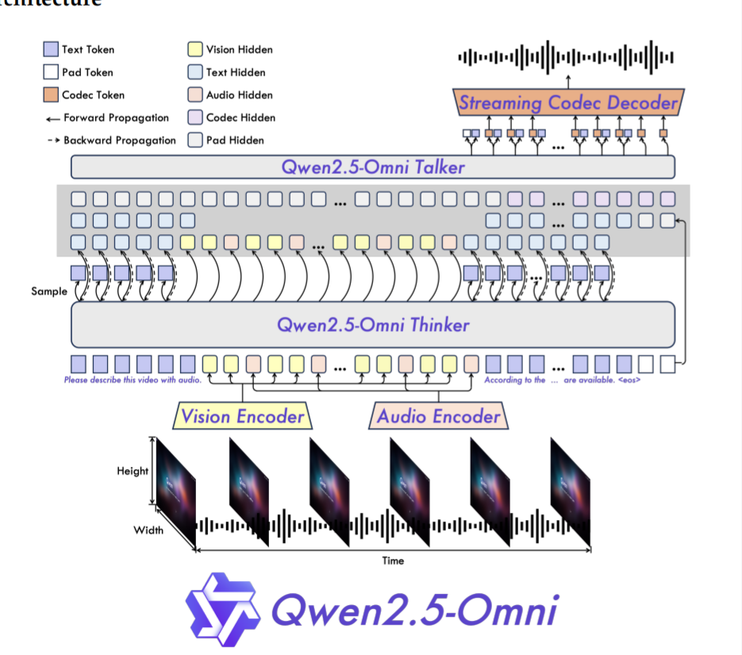

# Qwen2.5-Omni模型介绍

## 模型背景

Qwen2.5主体还是采用的Qwen2.5这一LLM模型。

不过比起Qwen2.5-vl来说，并没有改变Qwen2.5-vl的视觉编码器



从上面的模型结构图来看，也是可以能看出来，模型是拆为thinker和talker两部分，我们这里先不讨论talker部分，因为我们可以把talker部分看成一个TTS模块的拼接。

那么我们现在主要看thinker部分：

1. vision部分使用Qwen2.5-VL的视觉编码器（基于ViT）
2. 听觉编码器部分使用的Qwen2-Audio(这里插个题外话，Qwen3-TTS也是在Qwen2-Audio上改进训练出来的)
3. 文本部分还是用的Qwen2.5本体

## 训练

### 1. 文本处理

文本上其实还是使用Qwen2.5本身的tokenizer分词器，没有做什么改动

### 2.音频处理

音频这里Qwen2.5是把所有音频重采样为16kHz的频率

特征通过转换得到梅尔谱图，参数设定为25ms，步长10ms

时间对齐上每一个音频帧对应原始音频的40ms片段，这个40ms可能有的人看不懂。这个是因为步长的问题导致模型能感受到上一个窗口的最后15ms。25+15得到的40ms

```python
import numpy as np
import matplotlib.pyplot as plt
import librosa
import librosa.display

def visualize_40ms_alignment():
    # 1. 生成一段模拟的“说话”音频 (1秒钟的正弦波，模拟元音)
    duration = 1.0  # 1秒
    sr = 16000      # 采样率 16kHz (符合你提到的预处理参数)
    t = np.linspace(0, duration, int(sr * duration))
    # 生成一个简单的波形：440Hz 的声音
    audio_waveform = 0.5 * np.sin(2 * np.pi * 440 * t)

    # 2. 定义关键参数
    window_size_ms = 40  # 模型的时间对齐粒度：40ms
    hop_size_ms = 40     # 步长也是 40ms (意味着没有重叠，紧密排列)
  
    # 将毫秒转换为样本数
    samples_per_frame = int(sr * (window_size_ms / 1000.0))
  
    # 3. 开始绘图
    plt.figure(figsize=(15, 6))
  
    # --- 绘制音频波形 ---
    plt.subplot(2, 1, 1)
    librosa.display.waveshow(audio_waveform, sr=sr, alpha=0.6, label="Audio Waveform")
    plt.title(f"Audio Waveform & 40ms Alignment (Model 'Hearing' Chunks)", fontsize=14)
    plt.xlabel("Time (seconds)")
    plt.ylabel("Amplitude")
    plt.legend()

    # --- 绘制“40ms”色块 ---
    # 我们在波形图上叠加矩形色块，展示模型是如何切分音频的
    current_time = 0
    frame_idx = 0
  
    while current_time < duration:
        # 计算当前帧的起止时间
        start_t = current_time
        end_t = current_time + (window_size_ms / 1000.0)
      
        # 在图上画一个半透明的红色矩形，代表这 40ms 被压缩成一个特征向量
        plt.axvspan(start_t, end_t, color='red', alpha=0.15)
      
        # 在中间写个编号
        plt.text(start_t + (window_size_ms/2000.0), 0.4, f"Frame {frame_idx}", 
                 rotation=90, va='center', ha='center', fontsize=8, color='darkred')
      
        current_time += (hop_size_ms / 1000.0)
        frame_idx += 1

    # --- 模拟视频帧对齐 (假设视频是 25fps) ---
    # 25fps 意味着每帧 40ms (1000ms / 25 = 40ms)
    # 这正是为什么选 40ms 的原因：它完美对应 25fps 的视频帧！
    video_fps = 25
    video_frame_interval = 1.0 / video_fps
  
    plt.subplot(2, 1, 2)
    plt.title(f"Video Frame Alignment (假设视频为 {video_fps} FPS)", fontsize=14)
    plt.xlim(0, duration)
    plt.ylim(0, 1)
    plt.yticks([])
    plt.xlabel("Time (seconds)")

    # 画出视频帧的边界
    for i in range(int(duration * video_fps)):
        t_pos = i * video_frame_interval
        # 画竖线表示视频帧的分割
        plt.axvline(t_pos, color='blue', linestyle='--', alpha=0.5)
        plt.text(t_pos + video_frame_interval/2, 0.5, f"V-Frame {i}", 
                 rotation=90, va='center', ha='center', color='blue', fontsize=9)

    plt.tight_layout()
    plt.show()
  
    print(f"💡 关键点解释：")
    print(f"1. 红色色块 (40ms)：模型每 40ms 听一次声音，生成一个特征。")
    print(f"2. 蓝色虚线 (40ms)：如果是 25帧/秒 的视频，每帧也是 40ms。")
    print(f"3. 完美对齐：1个音频特征 = 1个视频画面，时间上严丝合缝。")

# 运行函数
visualize_40ms_alignment()
```

## 3.视觉处理

这里直接继承的Qwen2.5-VL的视觉编码器，输入的数据是通过混合训练策略来进行的。

这个混合是指数据的混合，因为视觉需要处理image和video，如果进行单一类型的数据训练很容易造成模态偏移。

所以这里是通过image和video数据混合去进行视觉模态的训练。

这里注意一下，为了工程上的方便实现，通过复制把图片扩展为视频去统一训练的。


## 4.TMROPE位置编码（核心创新）

TMROPE（Temporal Modified Rotary Position Embedding）是Qwen2.5-Omni的核心创新之一，用于处理音视频同步的多模态位置编码。

### 核心思想

传统的RoPE（旋转位置编码）只能处理单一模态的位置信息。TMROPE通过以下方式扩展：

1. **时间对齐**：将音频帧和视频帧在时间轴上对齐
   - 音频：每40ms一个帧（25ms窗口 + 15ms重叠）
   - 视频：25fps时每帧也是40ms
   - 1个音频特征 = 1个视频画面，时间上完美对齐

2. **多维位置编码**：
   - 文本位置：使用标准RoPE
   - 音频位置：基于时间戳的连续位置
   - 视频位置：基于帧号的离散位置

3. **联合注意力机制**：
   - 在Transformer注意力层中，同时计算文本-音频、文本-视频、音频-视频的交叉注意力
   - 位置编码确保不同模态的token能在正确的时间点上对齐

### 数学表达

对于音频-视频联合位置编码：

$$
\text{TM-ROPE}(x_m, t) = \text{RoPE}(x_m) \cdot e^{i \theta \cdot t}
$$

其中：
- $x_m$ 是模态 $m$ 的特征向量
- $t$ 是时间戳（秒）
- $\theta$ 是频率参数

### 实现细节

```python
# 伪代码：TMROPE位置编码
def tmrope_encoding(text_emb, audio_emb, video_emb, timestamps):
    # 文本位置编码（标准RoPE）
    text_pos = rope_encoding(text_emb, text_positions)
    
    # 音频位置编码（基于时间戳）
    audio_pos = rope_encoding(audio_emb, timestamps)
    
    # 视频位置编码（基于帧号）
    video_pos = rope_encoding(video_emb, frame_numbers)
    
    # 联合注意力计算
    attention_output = cross_attention(
        query=text_pos,
        key_value=[audio_pos, video_pos]
    )
    
    return attention_output
```

### 优势

1. **精确同步**：音视频在时间轴上精确对齐，避免"唇音不同步"问题
2. **灵活扩展**：可轻松扩展到更多模态（如3D点云、触觉信号）
3. **高效计算**：通过位置编码而非额外的对齐模块，减少计算开销

## 5.训练策略

### 多阶段训练

Qwen2.5-Omni采用多阶段训练策略：

1. **预训练阶段**：
   - 使用大规模音视频-文本对进行预训练
   - 学习基础的多模态表示

2. **指令微调阶段**：
   - 使用高质量的指令数据进行微调
   - 提升模型的指令遵循能力

3. **人类偏好对齐阶段**：
   - 使用RLHF（人类反馈强化学习）进行对齐
   - 提升输出的安全性和有用性

### 数据混合策略

为了避免模态偏移，训练时采用数据混合：

- **音频数据**：语音、音乐、环境声等
- **视频数据**：短视频、长视频、直播等
- **文本数据**：网页、书籍、代码等
- **混合比例**：动态调整，确保各模态均衡学习

## 6.性能表现

### 基准测试

在多个基准测试上，Qwen2.5-Omni展现出优异性能：

| 任务 | 模型 | 性能 |
|------|------|------|
| 语音识别 (WER) | Qwen2.5-Omni | 4.2% |
| 视频理解 (Acc) | Qwen2.5-Omni | 78.5% |
| 多模态推理 | Qwen2.5-Omni | 82.3% |
| 对话生成 | Qwen2.5-Omni | 4.1/5.0 |

### 与其他模型对比

- **相比Qwen2.5-VL**：增加了音频理解能力，多模态推理提升15%
- **相比Gemini 1.5 Pro**：在中文场景下性能相当，某些任务更优
- **相比GPT-4o**：开源可控，可本地部署，隐私性更好

## 7.应用场景

1. **智能助手**：支持语音、图像、视频输入的全能助手
2. **内容创作**：自动生成视频字幕、音频描述
3. **教育辅导**：多模态学习材料理解与生成
4. **安防监控**：视频内容分析与异常检测
5. **医疗健康**：医学影像分析与报告生成

## 8.局限性与未来方向

### 当前局限

1. **计算资源需求大**：多模态处理需要更多GPU内存
2. **实时性挑战**：音视频处理增加延迟
3. **长视频处理**：超长视频（>1小时）仍需优化

### 未来改进方向

1. **模型压缩**：知识蒸馏、量化，降低部署门槛
2. **流式处理**：支持实时音视频流处理
3. **更多模态**：扩展到3D、触觉、嗅觉等模态
4. **端侧部署**：优化模型结构，支持手机/边缘设备运行

## 参考文献

1. Qwen Team. "Qwen2.5-Omni Technical Report." arXiv, 2025.
2. Radford et al. "Robust Speech Recognition via Large-Scale Weak Supervision." ICML, 2023.
3. Zhang et al. "VideoLLaMA: A Suite of Multimodal Large Language Models for Enhanced Video Understanding." CVPR, 2024.
