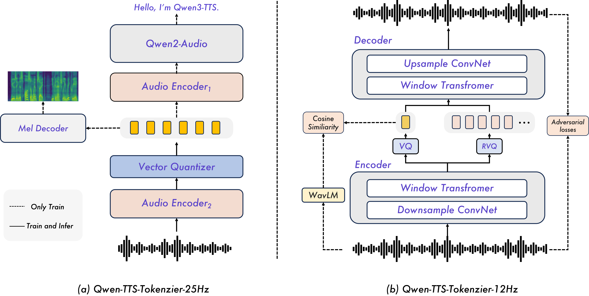

# Qwen3-TTS技术报告

## 1. 模型概述

Qwen认为具备的官方能力：

- 可控性
- 语音克隆与预设语音模版
- 自然度
- 多语言支持
- 流式传输

模型为了实时输出，做了单码本->多码本的转换，将单码本的模型转换成多码本的模型，方便多语言支持。
以及模型在token解码上做了MTP的优化，同时把多个码本进行还原。

## 2. 模型结构

模型结构如下：

首先Qwen-TTS-Tokenzier-25Hz,是用的Qwen2-Audio。
这里Qwen2-Audio是一个ASR模型，这里Qwen团队进行了两阶段训练。
第一阶段是继续做ASR的训练，第二阶段是基于卷积的梅尔谱图解码器对整个模型进行微调。

在第一阶段我们能看到模型插入了一个重采样层以及一个VQ层，这两个层的作用我们后面再介绍。

## 3.
