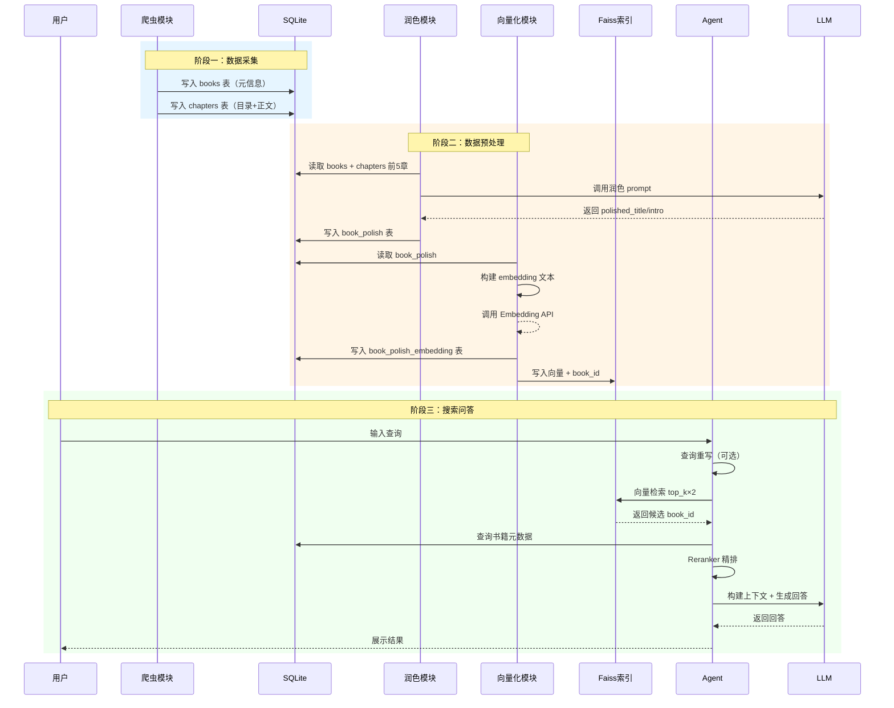
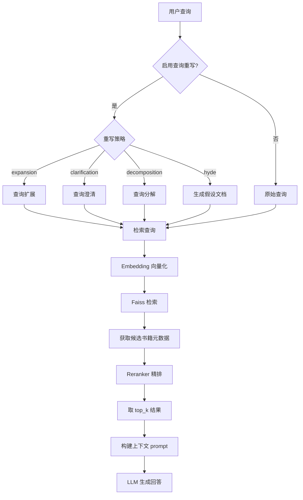

# 数据流向

本文档详细描述数据从爬取到最终回答的完整流转过程。

## 端到端数据流



## 阶段一：数据采集

### 数据来源

起点中文网 API，爬取两个维度的数据：

| 数据类型 | 写入表 | 字段 |
|----------|--------|------|
| 书籍元信息 | `books` | book_id, title, intro, author, category |
| 章节目录 | `chapters` | chapter_id, book_id, chapter_name, is_content_fetched |
| 章节正文 | `chapters` | content (UPDATE) |

### 爬取流程


**关键特性**：

- 断点续抓：`is_content_fetched` 标记已抓取章节
- 并发控制：`--concurrency` 参数控制并发数
- 请求限速：`--min-request-interval` + `--request-jitter` 打散请求

## 阶段二：数据预处理

### 2.1 文本润色

```
输入: books.title + books.intro + chapters.content (前5章)
  ↓
LLM 调用 (system: 中文小说文案编辑)
  ↓
输出: book_polish.polished_title + book_polish.polished_intro
```

**润色规则**：

- 基于前五章正文反向优化简介
- 保持叙事人称和文字气质一致
- 简介字数控制在 60-180 字
- 严禁修改世界观、角色姓名等事实

### 2.2 向量化

```
输入: book_polish.polished_title + book_polish.polished_intro
  ↓
拼接为: "书名：{title}\n简介：{intro}"
  ↓
Embedding API 调用
  ↓
输出: book_polish_embedding 表 + Faiss 索引
```

**向量处理**：

- L2 归一化后写入 Faiss
- 使用 `IndexIDMap2` 支持按 book_id 精确更新
- 索引文件与数据库同目录存储

### 2.3 LLM 打标

```
输入: books.title + books.intro
  ↓
LLM 调用 (扁平标签 / 级联标签)
  ↓
输出: JSON 文件 (tags / cascaded_tags)
```

**两种模式**：

- **flat**: 每本书生成独立的标签列表
- **cascading**: 先分大类再细分小类，形成层级标签

## 阶段三：搜索问答

### 查询处理流程



### 检索策略详解

#### Single（单路检索）

```
query → [rewrite] → embed → faiss.search → rerank → answer
```

最简单的策略，适合查询意图明确的场景。

#### Early Fusion（早期融合）

```
query → [rewrite: expansion, clarification, hyde]
     ↓
合并为: "query\nrewritten1\nrewritten2\nrewritten3"
     ↓
embed → faiss.search → rerank → answer
```

将多个改写版本合并为一个综合查询，利用所有语义信息进行单次检索。

#### Late Fusion（晚期融合）

```
query → [rewrite: expansion, clarification, hyde]
     ↓
对每个查询分别: embed → faiss.search
     ↓
RRF 融合: score = Σ(1/(k+rank))
     ↓
rerank → answer
```

多路独立检索后用 RRF（Reciprocal Rank Fusion）算法融合排序结果。

## 分片与同步流程


**增量同步机制**：

1. `export-shards --only-changed`：基于 `source_fingerprint` 判断分片是否变化
2. `upload --incremental`：基于本地 manifest 判断文件是否变化
3. `crawl-content`：基于 `is_content_fetched` 判断章节是否已抓取

## 状态管理

系统通过多个状态字段实现断点续跑：

| 状态 | 位置 | 说明 |
|------|------|------|
| `is_content_fetched` | chapters 表 | 章节正文是否已抓取 |
| `book_polish` 表存在 | book_polish 表 | 书籍是否已润色 |
| `book_polish_embedding` 表存在 | book_polish_embedding 表 | 书籍是否已向量化 |
| Faiss 索引中的 book_id | `.faiss` 文件 | 向量是否已写入索引 |
| `shards/index.json` | shards 目录 | 分片导出状态 |
| `.shards.modelscope-upload-manifest.json` | data 目录 | 上传同步状态 |
