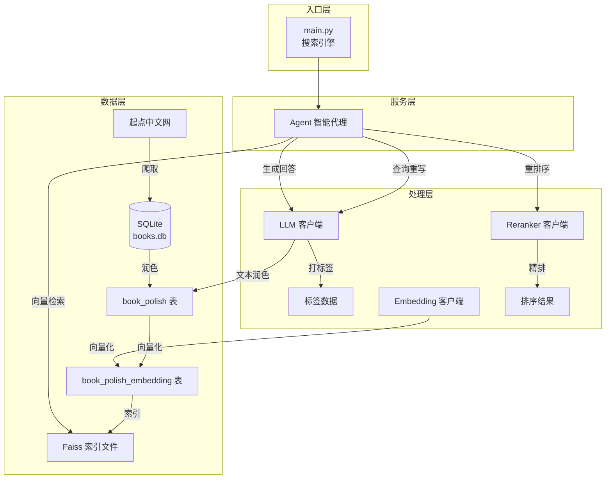
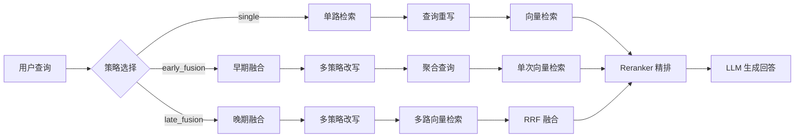
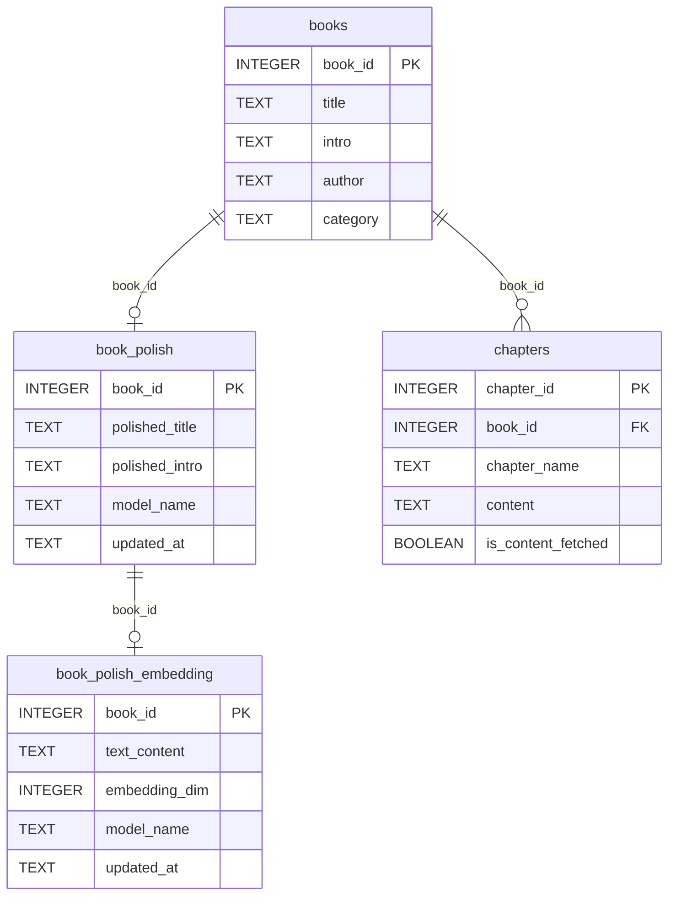
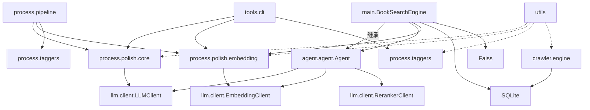

# 架构概览

## 系统定位

起点搜书是一个**端到端的小说智能推荐系统**，采用 RAG（Retrieval-Augmented Generation）架构，将向量检索与大语言模型结合，实现精准的书籍搜索和智能问答。

## 整体架构



## 核心设计思想

### 1. 分层解耦

系统采用四层架构，各层职责清晰：

| 层级 | 职责 | 核心模块 |
|------|------|----------|
| **数据层** | 数据存储与索引 | SQLite + Faiss |
| **处理层** | 文本处理与向量化 | LLM/Embedding/Reranker 客户端 |
| **服务层** | 智能代理与检索编排 | agent.agent.Agent + agent.search_agent.SearchAgent |
| **入口层** | 用户交互 | main.py CLI |

### 2. 增量处理

所有处理步骤都支持增量模式：

- **文本润色**: 默认跳过已润色的 book_id
- **向量化**: 默认跳过已有 embedding 的记录
- **LLM 打标**: 自动合并已有标签，优先处理新数据
- **数据爬取**: `crawl-content` 只抓未完成章节

### 3. 可插拔模型

所有模型调用都通过环境变量配置，支持随时切换：

```bash
# 切换 LLM 模型
export LLM_MODEL_NAME="qwen-plus"

# 切换 Embedding 模型
export EMBEDDING_MODEL_NAME="text-embedding-3-small"
```

## 检索策略

系统支持三种检索策略，适用于不同场景：



| 策略 | 原理 | 适用场景 |
|------|------|----------|
| **single** | 单个查询（可选重写）直接检索 | 简单明确的查询 |
| **early_fusion** | 将多个改写查询合并为一个综合查询 | 需要语义扩展的查询 |
| **late_fusion** | 多个查询分别检索，用 RRF 融合结果 | 复杂模糊的查询 |

## 数据库设计

### 核心表结构



### Faiss 索引

- **类型**: `IndexIDMap2(IndexFlatIP)` — 支持自定义 ID 的内积索引
- **存储**: 与数据库同目录，后缀 `.polish_embedding.faiss`
- **向量归一化**: 所有向量在写入前做 L2 归一化，使内积等价于余弦相似度

## 模块依赖关系



## 扩展点

系统预留了多个扩展点：

1. **模型替换**: 通过环境变量切换任意 OpenAI 兼容模型
2. **检索策略**: 在 `Agent.RETRIEVAL_STRATEGY_ALIASES` 中注册新策略
3. **查询重写**: 在 `Agent` 中添加新的重写模式和 prompt
4. **数据源**: 在 `crawler/` 中添加新的爬取适配器
5. **输出格式**: 修改 `answer_with_context` 的 prompt 模板
