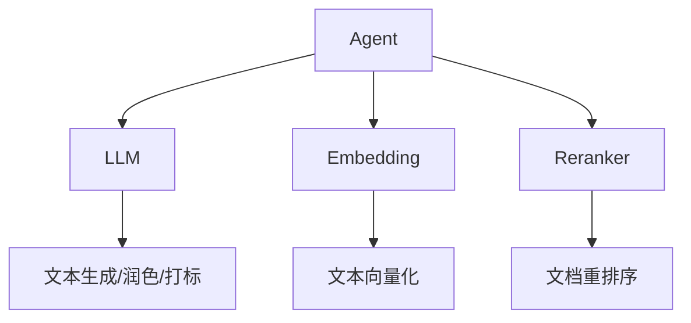

# 模型配置

本文档介绍系统支持的模型和配置方式。

## 模型架构



## LLM 模型

### 支持的模型

所有 OpenAI 兼容接口的模型都可以使用：

| 模型 | 提供商 | 推荐场景 |
|------|--------|----------|
| `gpt-4o-mini` | OpenAI | 性价比高，适合日常使用 |
| `gpt-4o` | OpenAI | 高质量生成 |
| `qwen-plus` | 阿里云 | 中文优化 |
| `qwen-turbo` | 阿里云 | 快速响应 |
| `deepseek-chat` | DeepSeek | 中文对话 |

### 配置方式

```bash
# 通过环境变量
export LLM_MODEL_NAME="qwen-plus"

# 通过代码
llm = LLMClient(model_name="qwen-plus")
```

### 模型选择建议

| 用途 | 推荐模型 | 原因 |
|------|----------|------|
| 文本润色 | `gpt-4o-mini` / `qwen-plus` | 需要较好的中文理解能力 |
| 查询重写 | `gpt-4o-mini` / `qwen-turbo` | 简单任务，快速响应 |
| 生成回答 | `gpt-4o-mini` / `qwen-plus` | 需要流畅的生成能力 |
| LLM 打标 | `gpt-4o-mini` / `qwen-plus` | 需要准确的分类能力 |

## Embedding 模型

### 支持的模型

| 模型 | 提供商 | 维度 | 说明 |
|------|--------|------|------|
| `text-embedding-3-small` | OpenAI | 1536 | 推荐，性价比高 |
| `text-embedding-3-large` | OpenAI | 3072 | 更高精度 |
| `text-embedding-v3` | 阿里云 | 1024/2048 | 中文优化 |

### 配置方式

```bash
export EMBEDDING_MODEL_NAME="text-embedding-3-small"
```

### 维度说明

- **1536 维**: `text-embedding-3-small`，适合大多数场景
- **3072 维**: `text-embedding-3-large`，更高精度但更慢
- **1024/2048 维**: `text-embedding-v3`，中文场景推荐

!!! note "维度一致性"
    切换 Embedding 模型后，需要重新生成所有向量并重建 Faiss 索引。

## Reranker 模型

### 支持的模型

| 模型 | 提供商 | 说明 |
|------|--------|------|
| `text-embedding-3-small` | OpenAI | 使用 Embedding 做重排 |
| `rerank-v3` | 阿里云 | 专业 Reranker 模型 |

### 配置方式

```bash
export RERANKER_MODEL_NAME="text-embedding-3-small"
```

## 模型组合推荐

### 方案一：全 OpenAI

```bash
LLM_MODEL_NAME=gpt-4o-mini
EMBEDDING_MODEL_NAME=text-embedding-3-small
```

优点：接口统一，稳定性好
缺点：成本较高

### 方案二：全阿里云

```bash
LLM_MODEL_NAME=qwen-plus
LLM_BASE_URL=https://dashscope.aliyuncs.com/compatible-mode/v1
EMBEDDING_MODEL_NAME=text-embedding-v3
EMBEDDING_BASE_URL=https://dashscope.aliyuncs.com/compatible-mode/v1
```

优点：中文优化，成本较低
缺点：需要阿里云账号

### 方案三：混合配置

```bash
LLM_MODEL_NAME=qwen-plus
LLM_BASE_URL=https://dashscope.aliyuncs.com/compatible-mode/v1
EMBEDDING_MODEL_NAME=text-embedding-3-small
EMBEDDING_BASE_URL=https://api.openai.com/v1
```

优点：各取所长
缺点：需要多个 API Key

## 本地模型

### 使用 Ollama

```bash
# 安装 Ollama
curl -fsSL https://ollama.com/install.sh | sh

# 拉取模型
ollama pull qwen2.5:7b
ollama pull nomic-embed-text

# 配置环境变量
export LLM_BASE_URL=http://localhost:11434/v1
export LLM_MODEL_NAME=qwen2.5:7b
export LLM_API_KEY=not-needed

export EMBEDDING_BASE_URL=http://localhost:11434/v1
export EMBEDDING_MODEL_NAME=nomic-embed-text
export EMBEDDING_API_KEY=not-needed
```

### 使用 vLLM

```bash
# 启动 vLLM 服务
python -m vllm.entrypoints.openai.api_server \
    --model Qwen/Qwen2.5-7B-Instruct \
    --port 8000

# 配置环境变量
export LLM_BASE_URL=http://localhost:8000/v1
export LLM_MODEL_NAME=Qwen/Qwen2.5-7B-Instruct
export LLM_API_KEY=not-needed
```

## 模型性能对比

### 润色质量

| 模型 | 中文理解 | 创意生成 | 响应速度 |
|------|----------|----------|----------|
| gpt-4o | ★★★★★ | ★★★★★ | ★★★☆☆ |
| gpt-4o-mini | ★★★★☆ | ★★★★☆ | ★★★★★ |
| qwen-plus | ★★★★★ | ★★★★☆ | ★★★★☆ |
| qwen-turbo | ★★★★☆ | ★★★☆☆ | ★★★★★ |

### Embedding 效果

| 模型 | 语义理解 | 中文支持 | 维度 |
|------|----------|----------|------|
| text-embedding-3-small | ★★★★☆ | ★★★★☆ | 1536 |
| text-embedding-3-large | ★★★★★ | ★★★★★ | 3072 |
| text-embedding-v3 | ★★★★☆ | ★★★★★ | 1024/2048 |
