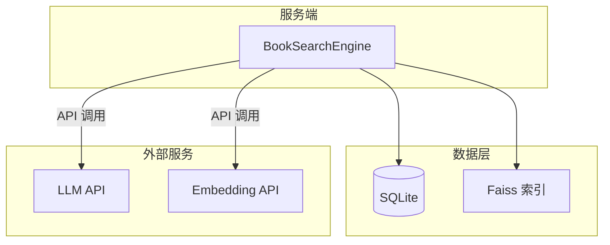

# 生产环境部署

本文档介绍如何在生产环境中部署小说搜索系统。

## 部署架构



## 系统要求

### 最低配置

- **CPU**: 2 核
- **内存**: 4GB
- **磁盘**: 20GB（根据数据量调整）
- **网络**: 需要访问 LLM/Embedding API

### 推荐配置

- **CPU**: 4 核+
- **内存**: 8GB+
- **磁盘**: 50GB+ SSD
- **网络**: 稳定的 API 访问

## 部署步骤

### 1. 环境准备

```bash
# 安装 Python
sudo apt update
sudo apt install python3.11 python3.11-venv

# 克隆项目
git clone https://github.com/918822019.github.io.git
cd 918822019.github.io/project/book_search

# 创建虚拟环境
python3.11 -m venv .venv
source .venv/bin/activate

# 安装依赖
pip install -r requirements.txt
pip install faiss-cpu
```

### 2. 配置环境

```bash
# 创建 .env 文件（存放密钥）
cat > .env << 'EOF'
LLM_API_KEY=your-api-key
LLM_BASE_URL=https://api.openai.com/v1
LLM_MODEL_NAME=gpt-4o-mini
EMBEDDING_API_KEY=your-api-key
EMBEDDING_BASE_URL=https://api.openai.com/v1
EMBEDDING_MODEL_NAME=text-embedding-3-small
EOF

# 非敏感参数（路径、超时等）在 config.yaml 中配置，已提供默认值
```

### 3. 准备数据

```bash
# 方式一：从 ModelScope 下载
python -m src.tools.download_modelscope_dataset \
    --repo-id wzywuan/Novel-Collection \
    --output-dir data

# 方式二：本地爬取
cd project/book_search
python -m src.crawler.engine crawl-books --start 1 --end 10000 --concurrency 12
python -m src.crawler.engine crawl-content --start 1 --end 10000 --concurrency 8
```

### 4. 预处理数据

```bash
python -c "
from src.process.pipeline import PreprocessPipelineConfig, run_preprocess_pipeline
cfg = PreprocessPipelineConfig(
    input_path='data/books.db',
    output_path='data/books_tagged.json',
    enable_text_polish=True,
    enable_polish_embedding=True,
    enable_llm_tagging=True,
    overwrite=False,
    sleep_seconds=0.1
)
print(run_preprocess_pipeline(cfg))
"
```

### 5. 启动服务

```bash
python main.py
```

## 使用 Docker

### Dockerfile

```dockerfile
FROM python:3.11-slim

WORKDIR /app

# 安装系统依赖
RUN apt-get update && apt-get install -y \
    gcc \
    && rm -rf /var/lib/apt/lists/*

# 安装 Python 依赖
COPY requirements.txt .
RUN pip install --no-cache-dir -r requirements.txt faiss-cpu

# 复制代码
COPY . .

# 启动命令
CMD ["python", "main.py"]
```

### 构建和运行

```bash
# 构建镜像
docker build -t book-search .

# 运行容器
docker run -d \
    --name book-search \
    -e LLM_API_KEY=your-key \
    -e EMBEDDING_API_KEY=your-key \
    -v $(pwd)/data:/app/data \
    book-search
```

## 性能优化

### SQLite 优化

```sql
-- 启用 WAL 模式
PRAGMA journal_mode = WAL;

-- 调整缓存大小
PRAGMA cache_size = -64000;  -- 64MB

-- 同步模式（生产环境用 NORMAL）
PRAGMA synchronous = NORMAL;
```

### Faiss 索引优化

```python
# 对于大规模数据，考虑使用 IVF 索引
import faiss

# IVF 索引（适合 >100万 向量）
nlist = 100  # 聚类中心数
quantizer = faiss.IndexFlatIP(dim)
index = faiss.IndexIVFFlat(quantizer, dim, nlist)
index.train(train_vectors)
index.add(vectors)
```


## 监控和日志


### 日志配置

```python
import logging

logging.basicConfig(
    level=logging.INFO,
    format='%(asctime)s - %(name)s - %(levelname)s - %(message)s',
    handlers=[
        logging.FileHandler('app.log'),
        logging.StreamHandler()
    ]
)
```

### 性能监控

```bash
# 监控数据库大小
ls -lh data/books.db

# 监控索引大小
ls -lh data/books.polish_embedding.faiss

# 监控进程资源
top -p $(pgrep -f "python main.py")
```

## 备份策略

### 数据库备份

```bash
# 定期备份
cp data/books.db data/books.db.backup.$(date +%Y%m%d)

# 使用 SQLite 在线备份
sqlite3 data/books.db ".backup 'data/books.db.backup'"
```

### 索引备份

```bash
# 备份 Faiss 索引
cp data/books.polish_embedding.faiss data/books.polish_embedding.faiss.backup
```

### 自动备份脚本

```bash
#!/bin/bash
# backup.sh

BACKUP_DIR="backups/$(date +%Y%m%d)"
mkdir -p $BACKUP_DIR

cp data/books.db $BACKUP_DIR/
cp data/books.polish_embedding.faiss $BACKUP_DIR/
cp data/books_tagged.json $BACKUP_DIR/

echo "备份完成: $BACKUP_DIR"
```

## 故障排查

### 数据库锁定

```bash
# 检查是否有其他进程占用
lsof data/books.db

# 等待进程完成后重试
```

### 内存不足

```bash
# 减少并发数
--concurrency 4

# 分批处理
--batch-size 20
```

### API 超时

```bash
# 增加超时时间
export REQUEST_TIMEOUT=120

# 增加重试间隔
--retry-backoff-base 2.0
```
