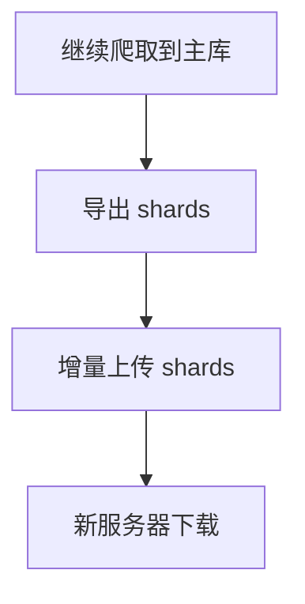

# ModelScope 数据上传

本文档介绍如何将数据上传到 ModelScope 数据集仓库。

## 前提条件

```bash
pip install modelscope
```

设置 API Token：

```bash
export MODELSCOPE_API_TOKEN="your-token"
```

## 上传工具

### upload_modelscope_dataset.py

位于 `src.tools.upload_modelscope_dataset`。

#### 基础用法

```bash
cd project/book_search

# Dry-run（仅预览，不上传）
python -m src.tools.upload_modelscope_dataset \
    --repo-id wzywuan/Novel-Collection \
    --folder-path data \
    --dry-run

# 正式上传
python -m src.tools.upload_modelscope_dataset \
    --repo-id wzywuan/Novel-Collection \
    --folder-path data \
    --commit-message "upload dataset"
```

#### 参数说明

| 参数 | 说明 |
|------|------|
| `--repo-id` | ModelScope 仓库 ID（格式：namespace/repo-name） |
| `--folder-path` | 要上传的目录 |
| `--incremental` | 增量上传模式 |
| `--dry-run` | 仅预览不上传 |
| `--run` | 执行上传 |
| `--sqlite-snapshot` | SQLite 快照策略 |
| `--include-hidden` | 包含隐藏文件 |
| `--commit-message` | 提交信息 |

#### SQLite 优化策略

默认开启，自动处理 SQLite 运行时文件：

| 策略 | 说明 |
|------|------|
| `auto`（默认） | 检测到 WAL/SHM 时才快照 |
| `always` | 所有 `.db` 一律先快照 |
| `never` | 直接上传原始 `.db` |

自动跳过的文件：`*.db-wal`、`*.db-shm`、`*.db-journal`

## 增量上传

### 推荐流程



### 导出分片

```bash
cd project/book_search

# 全量导出
python -m src.crawler.engine export-shards \
    --start 1 --end 10000 \
    --shard-size 200 \
    --output-dir ../data/shards

# 增量导出（只导出变化的分片）
python -m src.crawler.engine export-shards \
    --start 1 --end 10000 \
    --shard-size 200 \
    --output-dir ../data/shards \
    --only-changed
```

### 增量上传

```bash
cd project/book_search

# 预览将上传的文件
python -m src.tools.upload_modelscope_dataset \
    --repo-id wzywuan/Novel-Collection \
    --folder-path data/shards \
    --incremental \
    --dry-run

# 执行上传
python -m src.tools.upload_modelscope_dataset \
    --repo-id wzywuan/Novel-Collection \
    --folder-path data/shards \
    --incremental \
    --commit-message "incremental shard upload"
```

增量机制：

- 本地生成 manifest 文件记录文件状态
- 只上传新增和修改的文件
- 不自动删除远端已删除的文件

## 下载数据

### download_modelscope_dataset.py

位于 `src.tools.download_modelscope_dataset`。

#### 基础用法

```bash
cd project/book_search

# 下载全部数据
python -m src.tools.download_modelscope_dataset \
    --repo-id wzywuan/Novel-Collection \
    --repo-type dataset \
    --output-dir data

# 下载特定文件
python -m src.tools.download_modelscope_dataset \
    --repo-id wzywuan/Novel-Collection \
    --allow-pattern "*.db" \
    --allow-pattern "index.json" \
    --output-dir data/shards

# 下载前清空目标目录
python -m src.tools.download_modelscope_dataset \
    --repo-id wzywuan/Novel-Collection \
    --output-dir data/shards \
    --clean-output
```

#### 参数说明

| 参数 | 说明 |
|------|------|
| `--repo-id` | ModelScope 仓库 ID |
| `--repo-type` | 仓库类型（dataset/model） |
| `--revision` | 分支/版本 |
| `--output-dir` | 下载目录 |
| `--allow-pattern` | 文件匹配模式 |
| `--clean-output` | 下载前清空目标目录 |
| `--token` | API Token（可选，默认读环境变量） |

## 跨服务器断点续跑

### 旧服务器：上传完整数据

```bash
cd project/book_search

# 包含隐藏状态文件
python -m src.tools.upload_modelscope_dataset \
    --repo-id wzywuan/Novel-Collection \
    --folder-path data \
    --include-hidden \
    --commit-message "full data upload for resume"
```

### 新服务器：下载并恢复

```bash
cd project/book_search

# 1. 下载数据
python -m src.tools.download_modelscope_dataset \
    --repo-id wzywuan/Novel-Collection \
    --repo-type dataset \
    --output-dir data

# 2. 检查状态文件
test -f data/books.db && echo "OK books.db" || echo "MISS books.db"
test -f data/shards/index.json && echo "OK index.json" || echo "MISS index.json"

# 3. 查看当前进度
cd project/book_search
python -m src.crawler.engine stats

# 4. 继续抓正文
python -m src.crawler.engine crawl-content --start 1 --end 10000 --concurrency 8 --batch-size 40
```

### 关键状态文件

| 文件 | 说明 |
|------|------|
| `data/books.db` | 主数据库 |
| `data/shards/index.json` | 分片导出索引 |
| `data/.shards.modelscope-upload-manifest.json` | 上传同步状态 |

## 使用 Shell 脚本

### upload_modelscope.sh

```bash
chmod +x scripts/upload_modelscope.sh

# Dry-run
./scripts/upload_modelscope.sh \
    --repo-id wzywuan/Novel-Collection \
    --folder-path data

# 正式上传
./scripts/upload_modelscope.sh \
    --repo-id wzywuan/Novel-Collection \
    --folder-path data \
    --run

# 增量上传
./scripts/upload_modelscope.sh \
    --repo-id wzywuan/Novel-Collection \
    --folder-path data/shards \
    --incremental \
    --run
```

## 常见问题

### Token 过期

```bash
# 重新设置
export MODELSCOPE_API_TOKEN="new-token"
```

### 上传大文件慢

```bash
# 使用增量模式只上传变化的文件
python -m src.tools.upload_modelscope_dataset \
    --repo-id wzywuan/Novel-Collection \
    --folder-path data/shards \
    --incremental \
    --run
```

### SQLite 文件不一致

```bash
# 强制快照模式
python -m src.tools.upload_modelscope_dataset \
    --repo-id wzywuan/Novel-Collection \
    --folder-path data \
    --sqlite-snapshot always \
    --run
```
