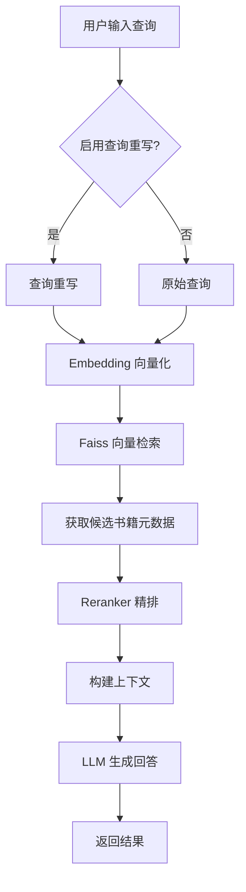
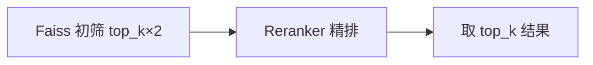

# 搜索问答指南

本文档介绍如何配置和使用系统的搜索问答功能。

## 搜索流程



## 快速启动

### 1. 确保数据就绪

```bash
# 检查数据库状态
cd project/book_search
python -m src.crawler.engine stats
```

### 2. 启动搜索引擎

```bash
cd project/book_search
python main.py
```

### 3. 输入查询

```
🔍 请输入您的问题: 有没有好看的都市异能小说？
```

## 检索策略

### Single（单路检索）

最简单的策略，适合查询意图明确的场景。

```bash
# 默认策略
books = engine.search_books_by_query("玄幻小说推荐", top_k=5)
```

流程：`query → [rewrite] → embed → faiss.search → rerank`

### Early Fusion（早期融合）

将多个改写查询合并为一个综合查询。

```python
# 通过 Agent 使用
answer = agent.search_and_answer(
    query="玄幻小说推荐",
    candidate_texts=candidate_texts,
    strategy="early_fusion"
)
```

流程：`query → [rewrite×N] → 合并 → embed → faiss.search → rerank`

优势：一次检索利用所有语义信息。

### Late Fusion（晚期融合）

多个查询分别检索，用 RRF 融合结果。

```python
answer = agent.search_and_answer(
    query="玄幻小说推荐",
    candidate_texts=candidate_texts,
    strategy="late_fusion"
)
```

流程：`query → [rewrite×N] → [embed→faiss.search]×N → RRF融合 → rerank`

优势：多角度检索，结果更全面。

## 查询重写

### Expansion（查询扩展）

添加相关同义词和近义词。

```python
rewritten = agent.rewrite_query("玄幻小说", mode="expansion")
# 输出: "玄幻小说 奇幻修真 仙侠 魔幻 冒险"
```

### Clarification（查询澄清）

消除歧义，使查询更具体。

```python
rewritten = agent.rewrite_query("那本好看的", mode="clarification")
# 输出: "那本口碑好、评分高的网络小说"
```

### Decomposition（查询分解）

将复杂问题拆分为子问题。

```python
rewritten = agent.rewrite_query("适合睡前看的轻松玄幻小说", mode="decomposition")
# 输出: "轻松风格的玄幻小说; 适合睡前阅读; 节奏舒缓"
```

### HyDE（假设文档）

生成假设性答案文档用于检索。

```python
rewritten = agent.rewrite_query("废柴逆袭玄幻", mode="hyde")
# 输出: "一本讲述天赋平庸的少年通过努力和机缘..."
```

## 自定义搜索

### 使用 BookSearchEngine

```python
from main import BookSearchEngine

# 初始化
engine = BookSearchEngine(db_path="data/books.db")
engine.connect()
engine.load_faiss_index()

# 搜索
books = engine.search_books_by_query("玄幻小说推荐", top_k=5)

for book in books:
    print(f"《{book['polished_title']}》")
    print(f"  简介: {book['polished_intro'][:100]}...")
    print(f"  分数: {book.get('rerank_score', book.get('score', 0)):.3f}")

# 生成回答
answer = engine.answer_with_context("玄幻小说推荐", books)
print(answer)

# 关闭
engine.close()
```

### 使用 SearchAgent

```python
from src.agent import SearchAgent

search_agent = SearchAgent()

# 准备候选文本（从数据库读取）
candidate_texts = ["书籍1简介", "书籍2简介", "书籍3简介"]

# 完整搜索问答
answer = search_agent.search_and_answer(
    query="玄幻小说推荐",
    candidate_texts=candidate_texts,
    top_k=5,
    use_rewrite=True,
    strategy="late_fusion"
)
print(answer)
```

## Reranker 精排

Reranker 在初步检索后对候选文档进行精细排序：



Reranker 使用交叉编码器（Cross-Encoder）计算查询与每个文档的相关性分数，比向量检索更精确但速度较慢。

## 性能调优

### 缩小检索范围

```python
# 减少 top_k
books = engine.search_books_by_query(query, top_k=3)
```

### 调整 API 间隔

```python
# 在预处理时增加间隔
sleep_seconds=0.2
```

### 选择合适策略

| 场景 | 推荐策略 | 原因 |
|------|----------|------|
| 简单查询 | `single` | 速度快，结果足够 |
| 语义丰富 | `early_fusion` | 利用多角度语义 |
| 模糊查询 | `late_fusion` | 多路检索更全面 |

## 示例查询

```
🔍 有没有好看的玄幻小说，主角是废柴逆袭的？
🔍 推荐几本轻松搞笑的都市小说
🔍 适合睡前看的治愈系小说
🔍 有什么高评分的科幻小说？
🔍 找一本女主视角的仙侠小说
```
