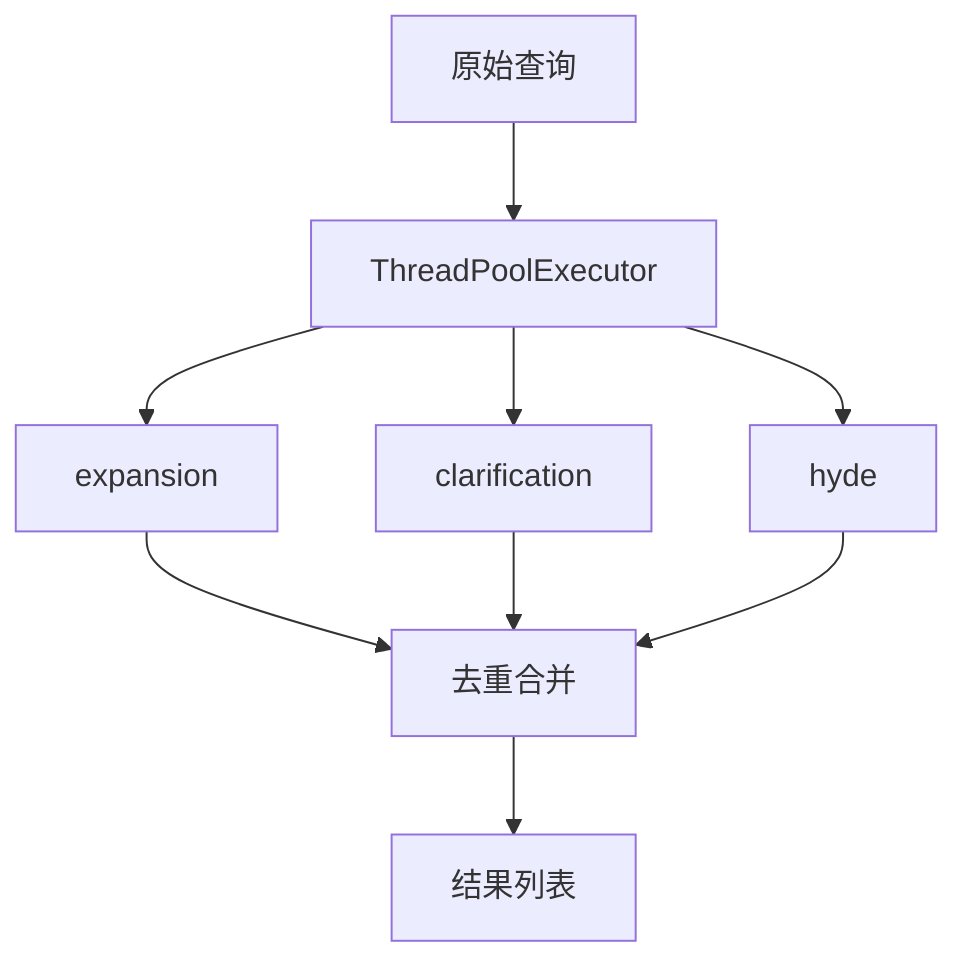
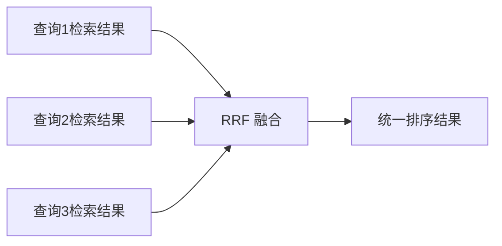

# Agent 智能代理

`agent.py` + `search_agent.py` 是系统的核心协调模块，整合 LLM、Embedding 和 Reranker 三大能力，提供统一的智能代理接口。

## 模块结构

```
src/agent/
├── __init__.py       # 模块导出
├── agent.py          # Agent 基类：基础操作 + 查询改写
└── search_agent.py   # SearchAgent(Agent)：检索策略 + 多路融合
```

- **Agent**: 客户端管理、文本生成、向量化、重排序、查询改写（4 种模式）
- **SearchAgent**: 继承 Agent，增加 `search_and_answer` 完整流程、策略解析、RRF 融合

---

## Agent（基类）

```python
from src.agent import Agent

class Agent:
    """智能代理类，整合 LLM、Embedding 和 Reranker 基础操作"""
```

### 初始化参数

| 参数 | 类型 | 默认值 | 说明 |
|------|------|--------|------|
| `llm_client` | `LLMClient` | `None`（自动创建） | LLM 客户端实例 |
| `embedding_client` | `EmbeddingClient` | `None`（自动创建） | Embedding 客户端实例 |
| `reranker_client` | `RerankerClient` | `None`（自动创建） | Reranker 客户端实例 |

```python
from src.agent import Agent

# 使用默认配置
agent = Agent()

# 自定义客户端
from src.llm.client import LLMClient
agent = Agent(llm_client=LLMClient(model_name="qwen-plus"))
```

### 核心方法

#### `process_query(query, context=None)`

处理用户查询，生成自然语言回答。

| 参数 | 类型 | 说明 |
|------|------|------|
| `query` | `str` | 用户查询文本 |
| `context` | `Optional[str]` | 可选的上下文信息 |
| **返回** | `str` | 生成的回答 |

```python
answer = agent.process_query("推荐一本玄幻小说")
```

#### `embed_text(text)`

将单个文本转换为向量。

```python
embedding = agent.embed_text("斗破苍穹：废柴少年的逆袭之路")
```

#### `embed_batch(texts)`

批量将文本转换为向量。

```python
embeddings = agent.embed_batch(["简介1", "简介2", "简介3"])
```

#### `rerank_documents(query, documents, top_k=5)`

对文档进行重排序。

```python
reranked = agent.rerank_documents("玄幻小说", documents, top_k=2)
# 返回: [(1, 0.95), (0, 0.87)]
```

### 查询改写

#### `rewrite_query(query, mode="expansion", context=None)`

| 模式 | 说明 | 示例 |
|------|------|------|
| `expansion` | 查询扩展，添加相关同义词 | "玄幻" → "玄幻 奇幻 魔幻 修仙 修真" |
| `clarification` | 查询澄清，消除歧义 | "那本书" → "《斗破苍穹》这本小说" |
| `decomposition` | 查询分解，拆分子问题 | "好看的玄幻" → "玄幻题材; 评分高; 主角有特点" |
| `hyde` | HyDE 模式，生成假设性文档 | "玄幻" → "一本讲述少年修炼成长的玄幻小说..." |

```python
rewritten = agent.rewrite_query("玄幻小说", mode="expansion")
rewritten = agent.rewrite_query("废柴逆袭", mode="hyde")
```

#### `rewrite_parallel(query, modes=None, context=None, max_workers=3)`

并行执行多策略改写，使用 `ThreadPoolExecutor` 同时调用 LLM，失败时回退到原始查询。

| 参数 | 类型 | 默认值 | 说明 |
|------|------|--------|------|
| `query` | `str` | - | 原始查询 |
| `modes` | `Optional[List[str]]` | `["expansion", "clarification", "hyde"]` | 重写模式列表 |
| `context` | `Optional[str]` | `None` | 对话历史 |
| `max_workers` | `int` | `3` | 并行线程数 |
| **返回** | `List[str]` | - | 去重后的重写结果 |

```python
queries = agent.rewrite_parallel("好看的玄幻小说", max_workers=4)
# 返回: ["好看的玄幻小说", "玄幻小说 奇幻修真", "一本讲述...的假设文档"]
```



---

## SearchAgent（检索问答代理）

```python
from src.agent import SearchAgent
```

继承 `Agent` 的全部能力，增加检索策略解析与多路融合。

### 检索策略别名

`SearchAgent.RETRIEVAL_STRATEGY_ALIASES` 定义了丰富的别名支持：

| 规范名 | 别名 |
|--------|------|
| `single` | `single` |
| `late_fusion` | `parallel`, `multi`, `multi_query` |
| `early_fusion` | `fusion`, `aggregated` |

### `search_and_answer(...)`

完整的搜索问答流程：查询重写 → 向量检索 → 重排序 → 生成回答。

| 参数 | 类型 | 默认值 | 说明 |
|------|------|--------|------|
| `query` | `str` | - | 用户原始查询 |
| `candidate_texts` | `List[str]` | - | 候选文档文本列表 |
| `top_k` | `int` | `5` | 重排序后保留的文档数 |
| `use_rewrite` | `bool` | `True` | 是否启用查询重写 |
| `rewrite_mode` | `str` | `"expansion"` | 单路重写模式 |
| `rewrite_modes` | `Optional[List[str]]` | `None` | 多路重写模式列表 |
| `strategy` | `str` | `"single"` | 检索策略 |
| `retrieval_strategy` | `Optional[str]` | `None` | strategy 别名 |
| `context` | `Optional[str]` | `None` | 对话历史 |
| **返回** | `str` | - | 基于文档生成的回答 |

#### 检索策略

| 策略 | 说明 |
|------|------|
| `single` | 单路检索，使用单个查询 |
| `late_fusion` | 晚期融合，多路检索后 RRF 合并 |
| `early_fusion` | 早期融合，合并查询后单次检索 |

```python
from src.agent import SearchAgent

search_agent = SearchAgent()

candidate_texts = ["书籍1简介", "书籍2简介", "书籍3简介"]

# 基础用法
answer = search_agent.search_and_answer("玄幻小说推荐", candidate_texts)

# 晚期融合
answer = search_agent.search_and_answer(
    query="玄幻小说推荐",
    candidate_texts=candidate_texts,
    strategy="late_fusion",
    use_rewrite=True
)
```

### RRF 融合算法

`_reciprocal_rank_fusion` 方法实现了 Reciprocal Rank Fusion 排序融合：

```python
score(doc) = Σ(1 / (k + rank_i))
```

其中 `k=60` 是平滑参数。



---

## 测试覆盖

`tests/test_agent_service.py` 包含 **57 个测试用例**，按类分组覆盖两个模块的全部公开方法：

| 测试类 | 覆盖范围 | 用例数 |
|--------|----------|--------|
| `TestAgentProcessQuery` | `process_query` 有/无/空 context | 3 |
| `TestAgentEmbed` | `embed_text` / `embed_batch` 单条/批量/空 | 3 |
| `TestAgentRerank` | `rerank_documents` 常规/超界/空 | 3 |
| `TestAgentRewriteQuery` | 4 种模式 + 未知模式 + 默认模式 + context 传递 | 7 |
| `TestAgentRewriteParallel` | 默认/自定义/全失败回退/部分失败过滤/空结果去重 | 6 |
| `TestAgentPromptBuilders` | 4 种 prompt 结构 + 带/不带 context | 6 |
| `TestSearchAgentNormalizeStrategy` | single / late_fusion 别名 / early_fusion 别名 / 未知 | 7 |
| `TestSearchAgentBuildFusedQuery` | 拼接/去重/空/空字符串过滤 | 4 |
| `TestSearchAgentRRF` | 基本 RRF / top_k / 单列表 / 空列表 | 4 |
| `TestSearchAgentRetrieveByQuery` | 委托链路验证 / top_k 限制 | 2 |
| `TestSearchAgentSearchAndAnswer` | 空候选/无改写/单策略/早融合/晚融合/别名/自定义模式/未知策略 | 11 |

```bash
# 运行 Agent 相关全部测试
pytest tests/test_agent_service.py -v
```
