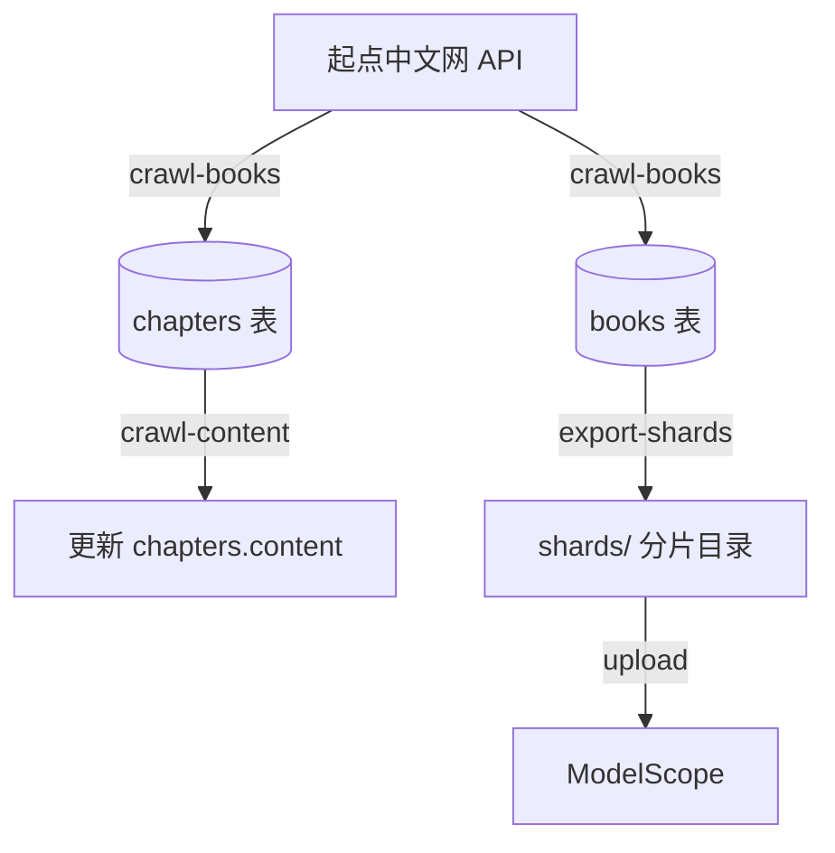
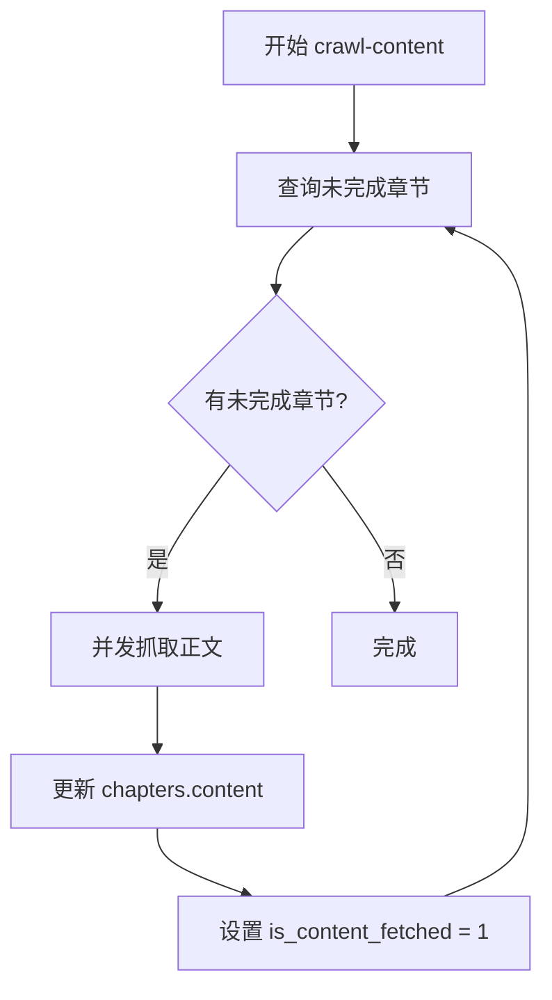
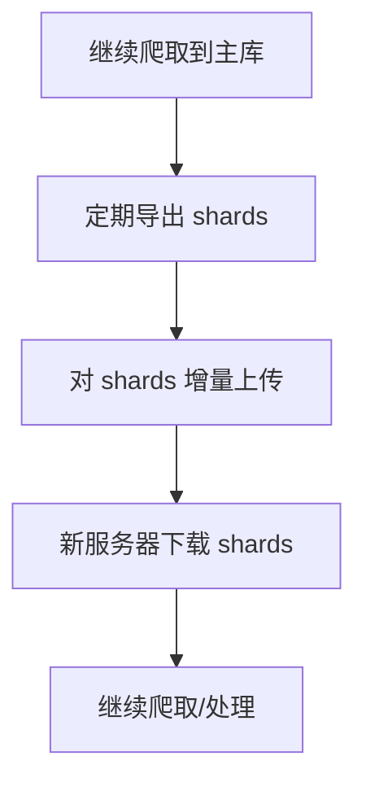

# 数据爬取

`src/crawler/engine.py`（通过 `python -m src.crawler.engine`）模块负责从起点中文网爬取书籍数据，支持并发抓取、断点续跑和分片导出。

## 架构概览



## 命令一览

| 命令 | 说明 |
|------|------|
| `crawl-books` | 抓取书籍元信息和章节目录 |
| `crawl-content` | 抓取章节正文内容 |
| `sync-all` | 按顺序执行目录抓取和正文抓取 |
| `stats` | 查看数据库统计信息 |
| `export-shards` | 导出分片 SQLite 文件 |

## crawl-books

抓取书籍首页和章节目录，写入 `books` 和 `chapters` 表。

### 参数

| 参数 | 类型 | 默认值 | 说明 |
|------|------|--------|------|
| `--start` | `int` | `1` | 起始 book_id |
| `--end` | `int` | `10000` | 结束 book_id |
| `--concurrency` | `int` | `12` | 并发请求数 |

### 使用示例

```bash
cd project/book_search

# 抓取 1-10000 号书籍
python -m src.crawler.engine crawl-books --start 1 --end 10000 --concurrency 12

# 小范围测试
python -m src.crawler.engine crawl-books --start 1 --end 100 --concurrency 4
```

### 数据库写入

```sql
-- books 表
INSERT INTO books (book_id, title, intro, author, category)
VALUES (?, ?, ?, ?, ?);

-- chapters 表
INSERT INTO chapters (chapter_id, book_id, chapter_name, is_content_fetched)
VALUES (?, ?, ?, 0);
```

## crawl-content

基于数据库中的章节目录，逐章抓取正文内容。

### 参数

| 参数 | 类型 | 默认值 | 说明 |
|------|------|--------|------|
| `--start` | `int` | `1` | 起始 book_id |
| `--end` | `int` | `10000` | 结束 book_id |
| `--concurrency` | `int` | `8` | 并发请求数 |
| `--batch-size` | `int` | `40` | 每批处理章节数 |
| `--chapter-progress-every` | `int` | `500` | 每 N 章输出进度 |
| `--sqlite-synchronous` | `str` | `NORMAL` | SQLite 同步模式 |
| `--min-request-interval` | `float` | `0.03` | 最小请求间隔（秒） |
| `--request-jitter` | `float` | `0.05` | 请求间隔随机抖动 |
| `--retry-backoff-base` | `float` | `1.5` | 重试退避基数 |
| `--retry-backoff-max` | `float` | `12` | 重试最大退避时间 |
| `--max-pending-per-book` | `int` | `0` | 每本书最多处理章节数（0=全部） |

### 使用示例

```bash
# 基础用法
python -m src.crawler.engine crawl-content --start 1 --end 10000 --concurrency 8 --batch-size 40

# 长时间后台运行（推荐参数）
python -m src.crawler.engine crawl-content \
    --start 1 --end 10000 \
    --concurrency 8 \
    --batch-size 40 \
    --chapter-progress-every 500 \
    --sqlite-synchronous FULL \
    --min-request-interval 0.03 \
    --request-jitter 0.05 \
    --retry-backoff-base 1.5 \
    --retry-backoff-max 12

# 小样本验证
python -m src.crawler.engine crawl-content \
    --start 1 --end 1 \
    --max-pending-per-book 5 \
    --batch-size 5
```

### 断点续抓

`crawl-content` 只抓取 `is_content_fetched = 0` 的章节：



### 请求特性

- **User-Agent 轮换**: 自动轮换多个 User-Agent
- **Referer 生成**: 按书籍页/章节页生成对应 Referer
- **限速控制**: `min-request-interval` + `request-jitter` 打散请求
- **重试机制**: 指数退避重试，遇到错误自动恢复

## sync-all

按顺序执行目录抓取和正文抓取。

```bash
python -m src.crawler.engine sync-all --start 1 --end 10000 --concurrency 12 --batch-size 120
```

等价于：

```bash
python -m src.crawler.engine crawl-books --start 1 --end 10000 --concurrency 12
python -m src.crawler.engine crawl-content --start 1 --end 10000 --concurrency 12 --batch-size 120
```

## stats

查看当前数据库的统计信息。

```bash
python -m src.crawler.engine stats
```

输出示例：

```
📊 数据库统计
============================================================
书籍总数:     1500
章节数:       45000
已抓取正文:   42000 (93.3%)
未抓取正文:   3000 (6.7%)
数据库大小:   256.3 MB
============================================================
```

## export-shards

将主库按 book_id 范围导出为分片 SQLite 文件。

### 参数

| 参数 | 类型 | 默认值 | 说明 |
|------|------|--------|------|
| `--start` | `int` | `1` | 起始 book_id |
| `--end` | `int` | `10000` | 结束 book_id |
| `--shard-size` | `int` | `200` | 每个分片的书籍数 |
| `--output-dir` | `str` | `../data/shards` | 输出目录 |
| `--only-changed` | `bool` | `False` | 只导出变化的分片 |

### 使用示例

```bash
# 全量导出
python -m src.crawler.engine export-shards \
    --start 1 --end 10000 \
    --shard-size 200 \
    --output-dir ../data/shards

# 增量导出
python -m src.crawler.engine export-shards \
    --start 1 --end 10000 \
    --shard-size 200 \
    --output-dir ../data/shards \
    --only-changed
```

### 输出结构

```
data/shards/
├── index.json              # 分片索引
├── books_0001_00200.db     # book_id 1-200
├── books_0201_0400.db      # book_id 201-400
├── books_0401_0600.db      # book_id 401-600
└── ...
```

### index.json 结构

```json
{
  "shards": [
    {
      "file": "books_0001_0200.db",
      "start_id": 1,
      "end_id": 200,
      "book_count": 200,
      "source_fingerprint": "abc123..."
    }
  ],
  "generated_at": "2024-01-01T00:00:00"
}
```

`source_fingerprint` 基于主库内容计算，用于 `--only-changed` 判断。

## SQLite 配置

### WAL 模式

系统使用 WAL（Write-Ahead Logging）模式，支持并发读写：

```sql
PRAGMA journal_mode = WAL;
```

### 同步模式

| 模式 | 说明 | 适用场景 |
|------|------|----------|
| `NORMAL` | 默认，平衡安全与性能 | 日常使用 |
| `FULL` | 最高安全性，每次写入都同步 | 长时间后台运行 |

使用 `FULL` 模式可以防止断电丢数据，但会降低写入性能。

## 增量上传建议流程



1. 继续爬取到主库 `data/books.db`
2. 定期导出 shards 到 `data/shards`
3. 对 `data/shards` 目录执行增量上传

详见 [ModelScope 数据上传](../guides/modelscope-upload.md)。
