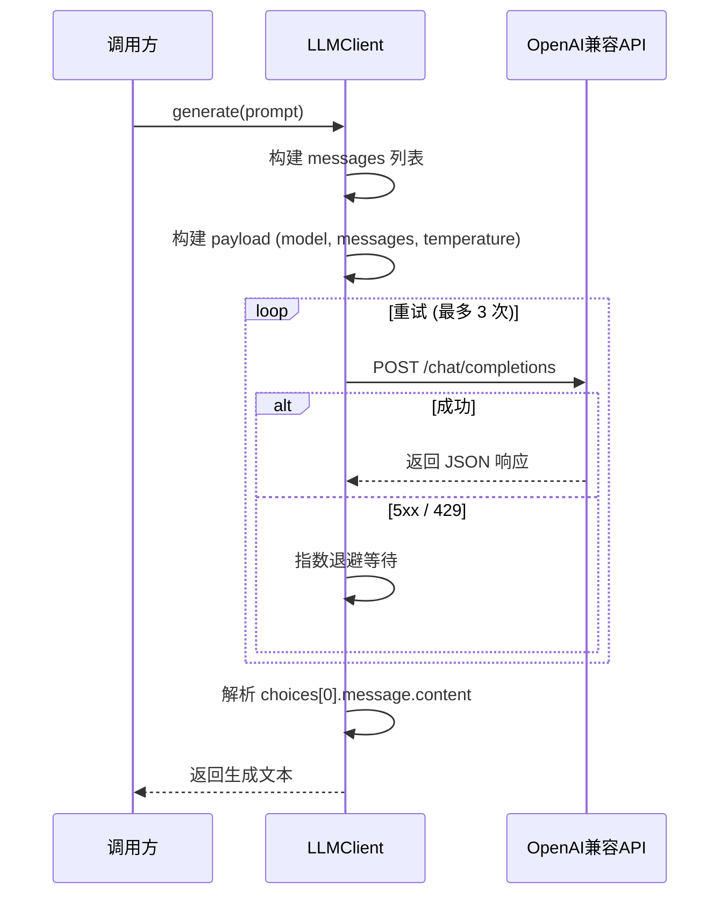
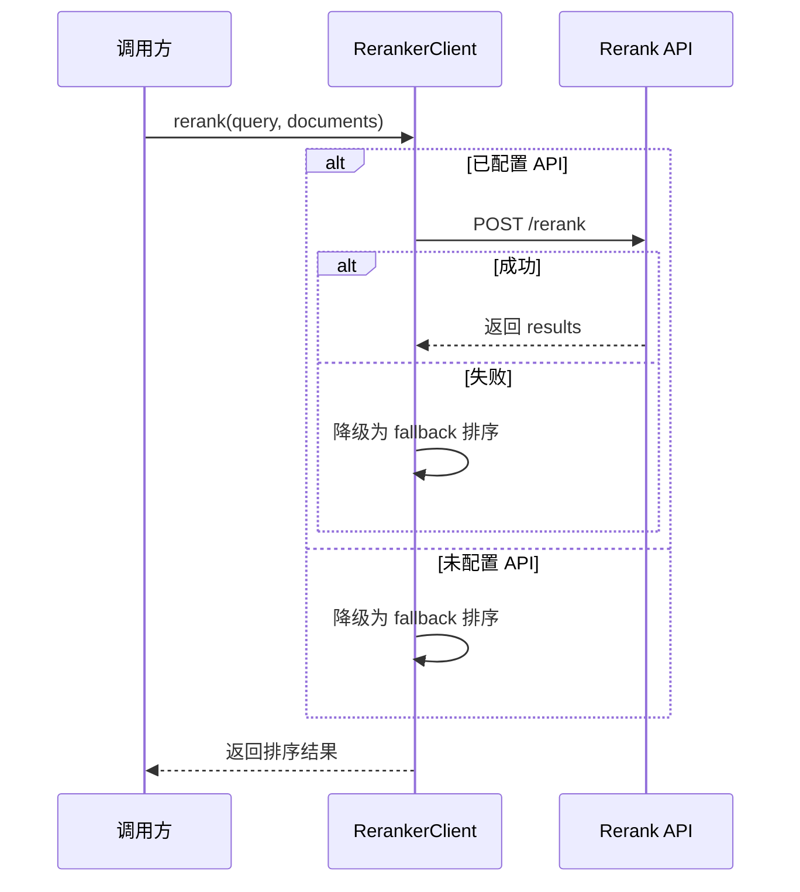
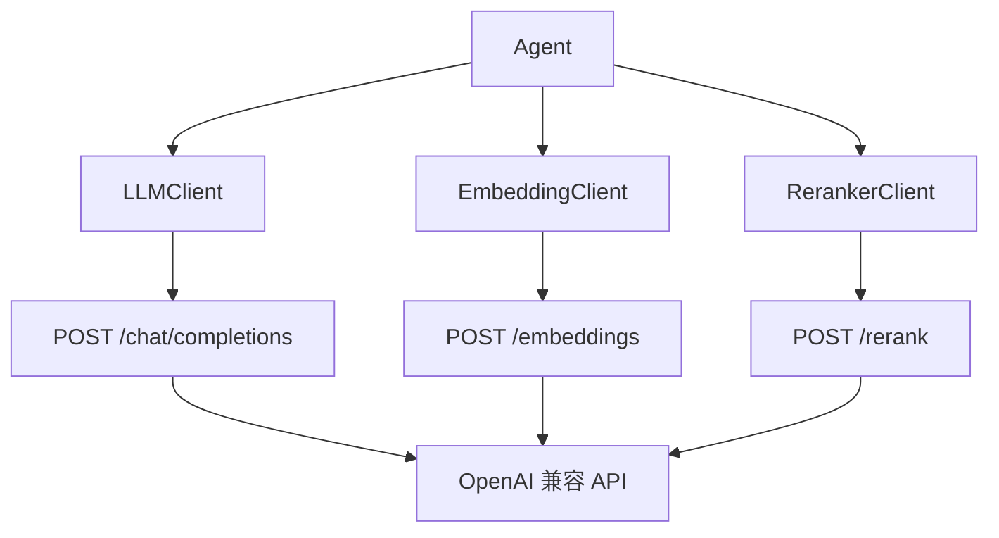

# LLM 客户端

系统包含三个独立的 LLM 相关客户端，分别负责文本生成、向量化和重排序。

## LLMClient（文本生成）

### 类定义

```python
class LLMClient:
    """LLM 客户端类，统一管理大语言模型调用"""
```

### 初始化

```python
LLMClient(
    model_name: Optional[str] = None,   # 默认从环境变量读取
    api_key: Optional[str] = None,      # 默认从环境变量读取
    base_url: Optional[str] = None,     # 默认从环境变量读取
)
```

### 核心方法

#### `generate(prompt, system_prompt=None, **kwargs)`

生成文本响应。

| 参数 | 类型 | 说明 |
|------|------|------|
| `prompt` | `str` | 用户提示词 |
| `system_prompt` | `Optional[str]` | 系统提示词 |
| `temperature` | `float` | 生成温度（默认 0.2） |
| **返回** | `str` | 生成的文本 |

```python
from src.llm.client import LLMClient

llm = LLMClient()

# 简单生成
response = llm.generate("推荐一本玄幻小说")

# 带系统提示词
response = llm.generate(
    prompt="推荐一本玄幻小说",
    system_prompt="你是一个资深的网络小说编辑",
    temperature=0.3
)
```

#### `chat(messages, **kwargs)`

对话式调用。

| 参数 | 类型 | 说明 |
|------|------|------|
| `messages` | `List[Dict]` | 消息列表 |
| **返回** | `str` | 助手回复 |

```python
messages = [
    {"role": "system", "content": "你是一个小说推荐专家"},
    {"role": "user", "content": "有什么好看的玄幻小说？"},
    {"role": "assistant", "content": "推荐《斗破苍穹》..."},
    {"role": "user", "content": "还有其他的吗？"}
]
response = llm.chat(messages)
```

#### `generate_with_context(query, context, **kwargs)`

基于上下文生成回答（RAG 场景）。

| 参数 | 类型 | 说明 |
|------|------|------|
| `query` | `str` | 用户查询 |
| `context` | `str` | 相关上下文信息 |
| **返回** | `str` | 基于上下文的回答 |

```python
context = """
书籍1: 《斗破苍穹》- 废柴少年萧炎的逆袭之路
书籍2: 《武动乾坤》- 林动的武道修炼之旅
"""
response = llm.generate_with_context(
    query="推荐废柴逆袭的玄幻小说",
    context=context
)
```

### 重试机制

所有客户端共享统一的 `_request_with_retry` 重试函数，在网络抖动或服务端错误时自动恢复：

| 参数 | 默认值 | 说明 |
|------|--------|------|
| `max_retries` | `3`（从 `MAX_RETRIES` 环境变量读取） | 最大重试次数 |
| `base_delay` | `1.0` 秒 | 初始退避延迟 |
| 重试策略 | 指数退避 | 延迟 = 1s → 2s → 4s |

- **5xx 错误**：自动重试（服务器临时故障）
- **429 错误**：自动重试（限流）
- **4xx 错误**（非 429）：不重试（客户端错误）
- 网络超时/连接异常：立即失败，不重试

### 调用流程



---

## EmbeddingClient（向量化）

### 类定义

```python
class EmbeddingClient:
    """Embedding 客户端类，统一管理文本向量化调用"""
```

### 初始化

```python
EmbeddingClient(
    model_name: Optional[str] = None,
    api_key: Optional[str] = None,
    base_url: Optional[str] = None,
)
```

### 核心方法

#### `embed(text)`

将单个文本转换为向量。

| 参数 | 类型 | 说明 |
|------|------|------|
| `text` | `str` | 输入文本 |
| **返回** | `List[float]` | 文本的向量表示 |

```python
from src.llm.client import EmbeddingClient

embedder = EmbeddingClient()
vector = embedder.embed("斗破苍穹：废柴少年的逆袭之路")
# 返回: [0.0234, -0.0156, 0.0891, ...]
```

#### `embed_batch(texts)`

批量将文本转换为向量。

| 参数 | 类型 | 说明 |
|------|------|------|
| `texts` | `List[str]` | 文本列表 |
| **返回** | `List[List[float]]` | 向量列表 |

```python
texts = ["文本1", "文本2", "文本3"]
vectors = embedder.embed_batch(texts)
# 返回: [[0.02, ...], [0.03, ...], [0.01, ...]]
```

#### `cosine_similarity(vec1, vec2)`

计算两个向量的余弦相似度。

| 参数 | 类型 | 说明 |
|------|------|------|
| `vec1` | `List[float]` | 向量1 |
| `vec2` | `List[float]` | 向量2 |
| **返回** | `float` | 余弦相似度 (0-1) |

```python
sim = embedder.cosine_similarity(vector1, vector2)
# 返回: 0.87 (表示两个文本比较相似)
```

#### `search_similar(query_embedding, candidates, top_k=5)`

在候选向量中搜索最相似的向量。

| 参数 | 类型 | 说明 |
|------|------|------|
| `query_embedding` | `List[float]` | 查询向量 |
| `candidates` | `List[List[float]]` | 候选向量列表 |
| `top_k` | `int` | 返回前 k 个结果 |
| **返回** | `List[Tuple[int, float]]` | `(索引, 相似度)` 列表 |

```python
results = embedder.search_similar(query_vec, candidate_vecs, top_k=3)
# 返回: [(2, 0.95), (0, 0.87), (1, 0.76)]
```

---

## RerankerClient（重排序）

### 类定义

```python
class RerankerClient:
    """Reranker 客户端类，统一管理重排序模型调用"""
```

### 初始化

```python
RerankerClient(
    model_name: Optional[str] = None,
    api_key: Optional[str] = None,
    base_url: Optional[str] = None,
)
```

### 核心方法

#### `rerank(query, documents, top_k=None)`

对文档列表按与 query 的相关性重排序。

| 参数 | 类型 | 说明 |
|------|------|------|
| `query` | `str` | 查询文本 |
| `documents` | `List[str]` | 待排序的文档列表 |
| `top_k` | `Optional[int]` | 返回前 k 个结果（默认全部） |
| **返回** | `List[Tuple[int, float]]` | `(原始索引, 相关性分数)` 列表 |

```python
from src.llm.client import RerankerClient

reranker = RerankerClient()
documents = ["文档A", "文档B", "文档C"]
results = reranker.rerank("玄幻小说", documents, top_k=2)
# 返回: [(1, 0.95), (0, 0.87)] — 按相关性降序
```

### 调用流程



### 降级策略

当 `RERANKER_BASE_URL` 或 `RERANKER_API_KEY` 未配置时，自动降级为按原始顺序返回：

```python
score(idx) = 1.0 - idx / len(documents)
```

这使得即使没有独立的 Reranker 服务，系统仍然可以正常工作，只是排序精度会下降。

---

## 环境变量配置

三个客户端共用以下环境变量模式：

| 环境变量 | 说明 | 默认值 |
|----------|------|--------|
| `LLM_API_KEY` | LLM API 密钥 | - |
| `LLM_BASE_URL` | LLM API 地址 | `https://api.openai.com/v1` |
| `LLM_MODEL_NAME` | LLM 模型名称 | `gpt-4o-mini` |
| `EMBEDDING_API_KEY` | Embedding API 密钥 | - |
| `EMBEDDING_BASE_URL` | Embedding API 地址 | `https://api.openai.com/v1` |
| `EMBEDDING_MODEL_NAME` | Embedding 模型名称 | `text-embedding-3-small` |
| `RERANKER_API_KEY` | Reranker API 密钥 | - |
| `RERANKER_BASE_URL` | Reranker API 地址 | `https://api.openai.com/v1` |
| `RERANKER_MODEL_NAME` | Reranker 模型名称 | - |
| `REQUEST_TIMEOUT` | 请求超时（秒） | `60` |
| `MAX_RETRIES` | 请求最大重试次数（指数退避） | `3` |

详细说明请参考 [环境变量配置](../configuration/environment.md)。

## 调用链路



所有客户端都使用 OpenAI 兼容接口，可以无缝对接：

- OpenAI GPT 系列
- 阿里云 Qwen 系列
- 其他兼容 OpenAI 接口的模型服务
