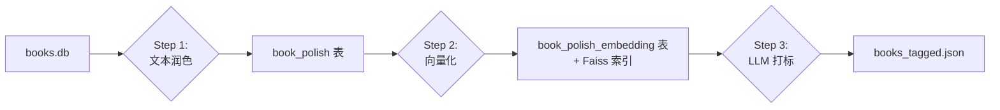
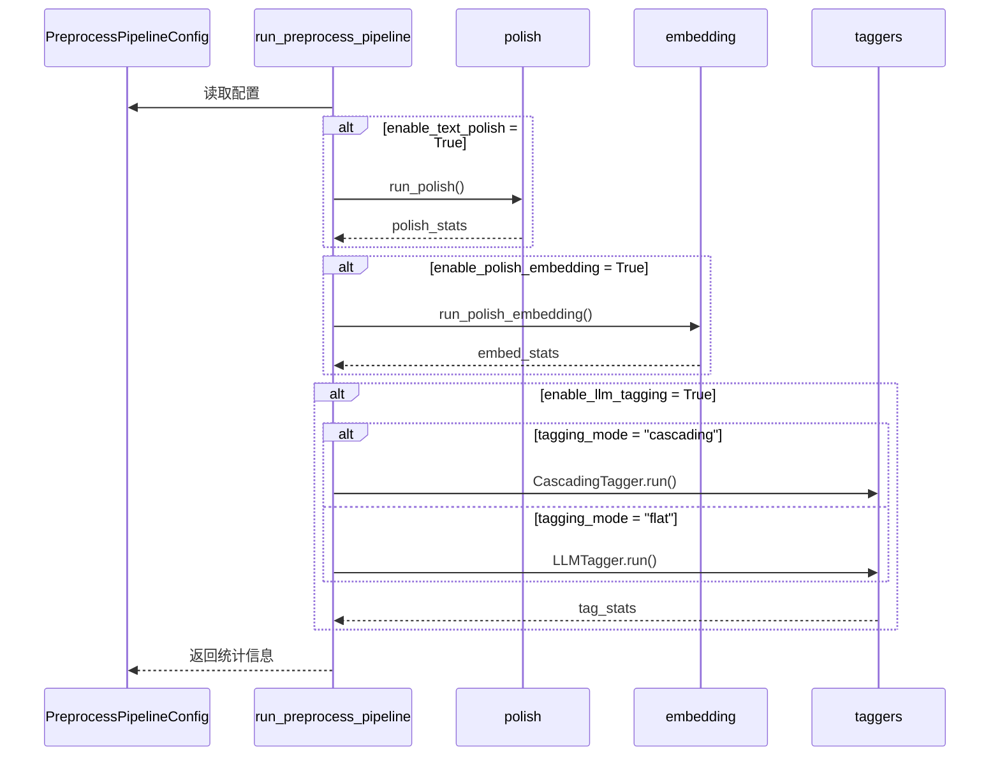
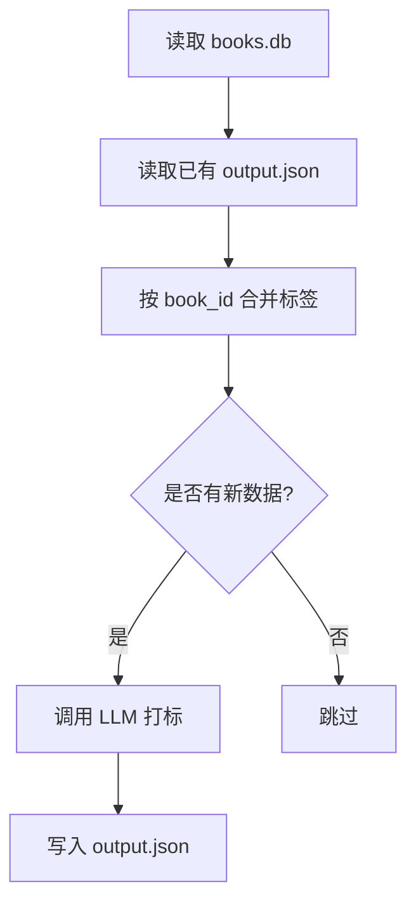

# 预处理流水线

`pipeline.py` 模块提供统一的预处理编排入口，将多个处理步骤组织成可复用的 Pipeline。

## 流水线概览



## PreprocessPipelineConfig

流水线配置类，使用 `dataclass` 定义。

### 配置字段

| 字段 | 类型 | 默认值 | 说明 |
|------|------|--------|------|
| `input_path` | `Union[str, Path]` | - | 输入数据库路径 |
| `output_path` | `Union[str, Path]` | - | 标签输出 JSON 路径 |
| `enable_text_polish` | `bool` | `True` | 启用文本润色 |
| `enable_polish_embedding` | `bool` | `True` | 启用向量化 |
| `enable_llm_tagging` | `bool` | `True` | 启用 LLM 打标 |
| `polish_model_name` | `Optional[str]` | `None` | 润色模型（None 用默认） |
| `embedding_model_name` | `Optional[str]` | `None` | Embedding 模型 |
| `tagging_mode` | `Literal["flat", "cascading"]` | `"flat"` | 标签模式 |
| `model_name` | `Optional[str]` | `None` | 打标模型 |
| `max_tags` | `int` | `8` | 每本书最多标签数（flat 模式） |
| `sleep_seconds` | `float` | `0.0` | API 调用间隔（秒） |
| `overwrite` | `bool` | `False` | 是否覆盖已有数据 |
| `limit` | `int` | `0` | 处理数量限制（0=全部） |
| `incremental_tagging` | `bool` | `True` | 增量打标模式 |

### 使用示例

```python
from src.process.pipeline import PreprocessPipelineConfig

# 完整 Pipeline
config = PreprocessPipelineConfig(
    input_path="data/books.db",
    output_path="data/books_tagged.json",
    enable_text_polish=True,
    enable_polish_embedding=True,
    enable_llm_tagging=True,
    tagging_mode="flat",
    overwrite=False,
    limit=0,
    sleep_seconds=0.1
)
```

## `run_preprocess_pipeline(config)`

执行预处理 Pipeline 的主函数。

| 参数 | 类型 | 说明 |
|------|------|------|
| `config` | `PreprocessPipelineConfig` | Pipeline 配置 |
| **返回** | `dict[str, Any]` | 流程统计信息 |

### 返回结构

```python
{
    "input_path": "data/books.db",
    "output_path": "data/books_tagged.json",
    "steps": [
        {
            "name": "text_polish",
            "enabled": True,
            "stats": {
                "total": 1500,
                "processed": 100,
                "changed": 95,
                "skipped": 1400,
                "failed": 5
            }
        },
        {
            "name": "polish_embedding",
            "enabled": True,
            "stats": {
                "total": 1500,
                "processed": 100,
                "changed": 98,
                "skipped": 1400,
                "failed": 2
            }
        },
        {
            "name": "llm_tagging",
            "enabled": True,
            "mode": "flat",
            "stats": {
                "total": 1500,
                "processed": 100,
                "changed": 100,
                "skipped": 1400,
                "failed": 0,
                "merged_existing_tag_fields": 0
            }
        }
    ]
}
```

## 执行流程



## 各步骤详解

### Step 1: 文本润色

调用 `run_polish()` 函数，基于前五章正文优化书名和简介。

```python
from src.process.polish import run_polish

stats = run_polish(
    db_path=Path("data/books.db"),
    model_name=None,          # 使用默认模型
    limit=0,                  # 处理全部
    sleep_seconds=0.1,        # API 调用间隔
    overwrite=False           # 跳过已润色
)
```

**处理逻辑**：

1. 从 `books` 表读取 book_id, title, intro
2. 从 `chapters` 表读取前 5 章正文
3. 构建润色 prompt 发送给 LLM
4. 解析 JSON 响应获取 polished_title 和 polished_intro
5. 写入 `book_polish` 表

### Step 2: 向量化

调用 `run_polish_embedding()` 函数，生成文本向量并写入 Faiss。

```python
from src.process.polish import run_polish_embedding

stats = run_polish_embedding(
    db_path=Path("data/books.db"),
    model_name=None,
    limit=0,
    sleep_seconds=0.1,
    overwrite=False
)
```

**处理逻辑**：

1. 从 `book_polish` 表读取 polished_title 和 polished_intro
2. 拼接为 "书名：{title}\n简介：{intro}" 格式
3. 调用 Embedding API 生成向量
4. 写入 Faiss 索引（IndexIDMap2，支持按 book_id 更新）
5. 写入 `book_polish_embedding` 元数据表

### Step 3: LLM 打标

支持两种标签模式：

#### Flat 模式

```python
from src.process.taggers import LLMTagger

tagger = LLMTagger(
    model_name=None,
    max_tags=8,
    sleep_seconds=0.1,
    overwrite=False,
    limit=0
)
stats = tagger.run(output_path=Path("data/books_tagged.json"))
```

#### Cascading 模式

```python
from src.process.taggers import CascadingTagger

tagger = CascadingTagger(
    model_name=None,
    sleep_seconds=0.1
)
stats = tagger.run(output_path=Path("data/books_tagged.json"))
```

## 增量处理机制

### 文本润色增量

- `overwrite=False` 时，跳过 `book_polish` 表中已存在的 book_id
- `overwrite=True` 时，重新润色所有书籍

### 向量化增量

- 检查 `book_polish_embedding` 表和 Faiss 索引
- 两者都存在且 `overwrite=False` 时跳过

### LLM 打标增量

- 读取已有 `output_path` 文件
- 按 book_id 合并历史 tags/cascaded_tags
- 只对新数据执行 LLM 调用



## 常见用法

### 完整 Pipeline

```bash
python -c "
from src.process.pipeline import PreprocessPipelineConfig, run_preprocess_pipeline
cfg = PreprocessPipelineConfig(
    input_path='data/books.db',
    output_path='data/books_tagged.json',
    enable_text_polish=True,
    enable_polish_embedding=True,
    enable_llm_tagging=True,
    tagging_mode='flat',
    overwrite=False,
    limit=0,
    sleep_seconds=0.1
)
print(run_preprocess_pipeline(cfg))
"
```

### 只做润色和向量化

```bash
python -c "
from src.process.pipeline import PreprocessPipelineConfig, run_preprocess_pipeline
cfg = PreprocessPipelineConfig(
    input_path='data/books.db',
    output_path='data/books_tagged.json',
    enable_text_polish=True,
    enable_polish_embedding=True,
    enable_llm_tagging=False,
    overwrite=False,
    limit=200,
    sleep_seconds=0.1
)
print(run_preprocess_pipeline(cfg))
"
```

### 只做 LLM 打标

```bash
python -c "
from src.process.pipeline import PreprocessPipelineConfig, run_preprocess_pipeline
cfg = PreprocessPipelineConfig(
    input_path='data/books.db',
    output_path='data/books_tagged.json',
    enable_text_polish=False,
    enable_polish_embedding=False,
    enable_llm_tagging=True,
    tagging_mode='cascading',
    overwrite=False,
    limit=0
)
print(run_preprocess_pipeline(cfg))
"
```
