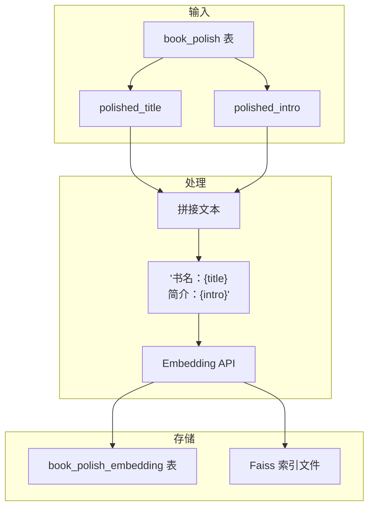
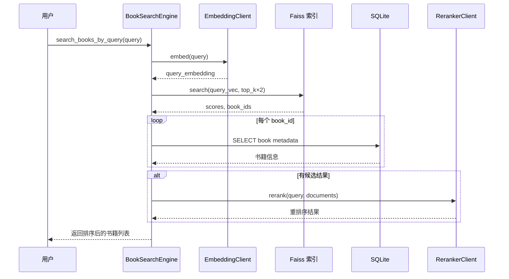

# 向量化与检索

本文档详细说明系统的向量化存储和检索机制。

## 向量化架构



## 数据库表结构

### book_polish 表

```sql
CREATE TABLE book_polish (
    book_id INTEGER PRIMARY KEY,
    source_title TEXT,
    source_intro TEXT,
    polished_title TEXT NOT NULL,
    polished_intro TEXT NOT NULL,
    model_name TEXT,
    updated_at TEXT NOT NULL,
    FOREIGN KEY (book_id) REFERENCES books(book_id) ON DELETE CASCADE
);
```

### book_polish_embedding 表

```sql
CREATE TABLE book_polish_embedding (
    book_id INTEGER PRIMARY KEY,
    text_content TEXT NOT NULL,
    embedding_dim INTEGER NOT NULL,
    model_name TEXT,
    updated_at TEXT NOT NULL,
    FOREIGN KEY (book_id) REFERENCES books(book_id) ON DELETE CASCADE
);
```

## Faiss 索引

### 索引类型

```python
import faiss

# IndexIDMap2: 支持自定义 ID 的映射索引
# IndexFlatIP: 内积（Inner Product）平坦索引
index = faiss.IndexIDMap2(faiss.IndexFlatIP(dim))
```

- **IndexIDMap2**: 允许使用 book_id 作为向量 ID，支持精确的增删改
- **IndexFlatIP**: 暴力搜索，精确匹配，适合中小规模数据（<100万）

### 索引文件

| 文件 | 说明 |
|------|------|
| `data/books.polish_embedding.faiss` | Faiss 索引文件 |
| `data/books.db` | SQLite 数据库（存储元数据） |

### 向量归一化

所有向量在写入前做 L2 归一化：

```python
import numpy as np

vec = np.asarray(embedding, dtype=np.float32).reshape(1, -1)
faiss.normalize_L2(vec)  # 归一化后内积等价于余弦相似度
```

## 核心操作

### 写入向量

```python
from src.process.polish import _upsert_vector, load_or_create_faiss_index

# 加载或创建索引
index = load_or_create_faiss_index(index_path, dim=1536)

# 写入/更新向量
_upsert_vector(
    index=index,
    book_id=12345,
    embedding=[0.02, -0.01, ...],  # 1536 维向量
    overwrite=False  # 不覆盖已有
)
```

### 读取索引

```python
from src.process.polish._faiss import _get_index_ids

# 获取所有已索引的 book_id
ids = _get_index_ids(index)
# 返回: {1, 2, 3, 12345, ...}
```

### 搜索相似向量

```python
import faiss
import numpy as np

# 准备查询向量
query_vec = np.asarray([query_embedding], dtype=np.float32)
faiss.normalize_L2(query_vec)

# 搜索
scores, indices = index.search(query_vec, top_k)
# scores: 相似度分数数组
# indices: 对应的 book_id 数组
```

## 检索流程



## BookSearchEngine

`main.py` 中的 `BookSearchEngine` 类整合了完整的搜索流程。

### 初始化

```python
engine = BookSearchEngine(db_path="data/books.db")
engine.connect()  # 连接数据库
```

### 检查向量化状态

```python
status = engine.check_vectorization_status()
print(status)
# {
#     "polished_books": 1500,
#     "embedded_books": 1500,
#     "need_embedding": 0,
#     "is_fully_embedded": True
# }
```

### 执行向量化

```python
stats = engine.vectorize_books(limit=100, overwrite=False)
# {
#     "total": 1500,
#     "processed": 100,
#     "changed": 95,
#     "skipped": 5,
#     "failed": 0
# }
```

### 搜索书籍

```python
books = engine.search_books_by_query("玄幻小说推荐", top_k=5)
# [
#     {
#         "book_id": 123,
#         "score": 0.923,
#         "original_title": "斗破苍穹",
#         "polished_title": "斗破苍穹",
#         "polished_intro": "废柴少年萧炎的逆袭之路...",
#         "rerank_score": 0.951,
#         "final_rank": 1
#     },
#     ...
# ]
```

### 生成回答

```python
answer = engine.answer_with_context("玄幻小说推荐", books)
# "根据您的需求，为您推荐以下几本玄幻小说..."
```

## 性能优化

### 索引优化

- 使用 `IndexIDMap2` 支持增量更新，避免重建整个索引
- 向量归一化后使用内积搜索，等价于余弦相似度
- 索引文件与数据库同目录，减少 IO 跳转

### 搜索优化

- 初筛阶段检索 `top_k × 2` 个候选，给 Reranker 更多选择
- Reranker 精排后取最终 `top_k` 个结果
- 使用 Faiss 的批量搜索 API，单次调用完成

### 写入优化

- 增量写入：跳过已存在的 book_id
- 批量提交：每本书处理完后 `conn.commit()`
- 延迟写入：Faiss 索引在所有向量处理完后一次性写入文件

## 维护操作

### 重建索引

如果索引损坏，可以删除后重新向量化：

```bash
# 1. 删除索引文件
rm data/books.polish_embedding.faiss

# 2. 重新执行向量化
python -c "
from src.process.pipeline import PreprocessPipelineConfig, run_preprocess_pipeline
cfg = PreprocessPipelineConfig(
    input_path='data/books.db',
    output_path='data/books_tagged.json',
    enable_text_polish=False,
    enable_polish_embedding=True,
    enable_llm_tagging=False,
    overwrite=True
)
print(run_preprocess_pipeline(cfg))
"
```

### 检查索引完整性

```python
import faiss
from pathlib import Path

index_path = Path("data/books.polish_embedding.faiss")
index = faiss.read_index(str(index_path))

print(f"索引维度: {index.d}")
print(f"向量数量: {index.ntotal}")
```
