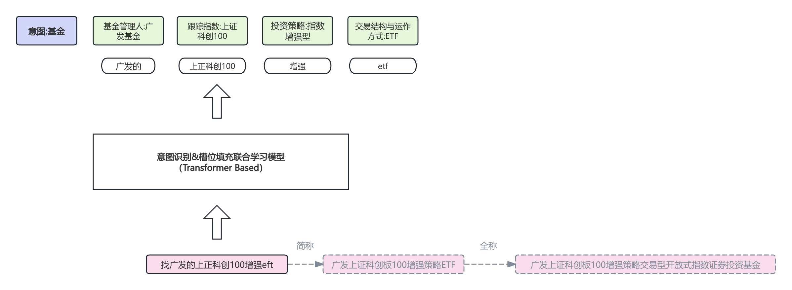

# 实体识别 + 意图识别

## 业务背景
这边的京东基金搜索的时候，在之前的过程中因为存在基金公司/基金名称/基金品种等实体信息的识别问题，导致用户搜索体验不佳，影响了用户的使用效率和满意度。因此，我们需要通过实体识别技术来提升搜索的准确性和相关性，从而改善用户体验。

同时为了更好的返回内容，也需要对用户的输入进行意图识别，从而返回更相关的内容。

## 模型思路
这边业务是使用bert的模型进行实体识别和意图识别，首先对输入进行预处理，然后使用bert模型进行训练，最后对输入进行预测，返回结果。
需要关注的点:
1. 数据集是如何构建的，数据量有多少，数据集的格式是什么。
2. 模型的训练过程是怎样的，使用了哪些超参数，训练了多少轮。模型的优化器是什么，损失函数是什么。
3. 模型的评估指标是什么，模型的效果如何。
4. 模型的架构是什么，算力多少，要求多少qps